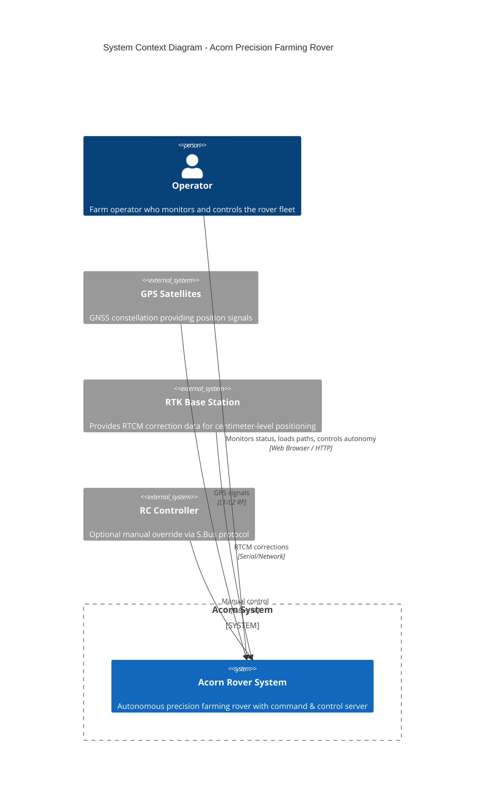
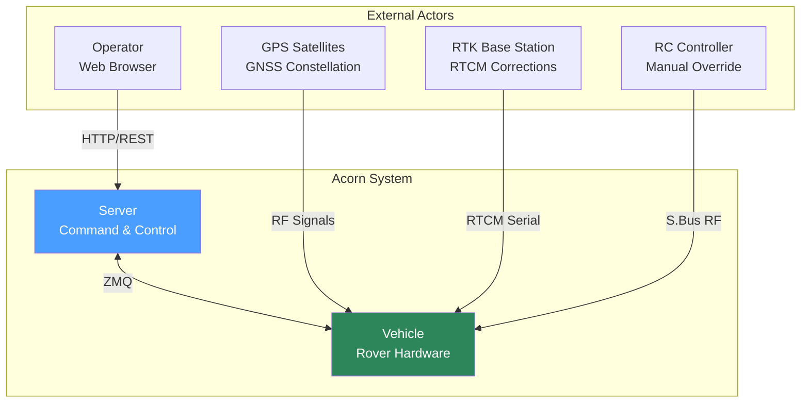
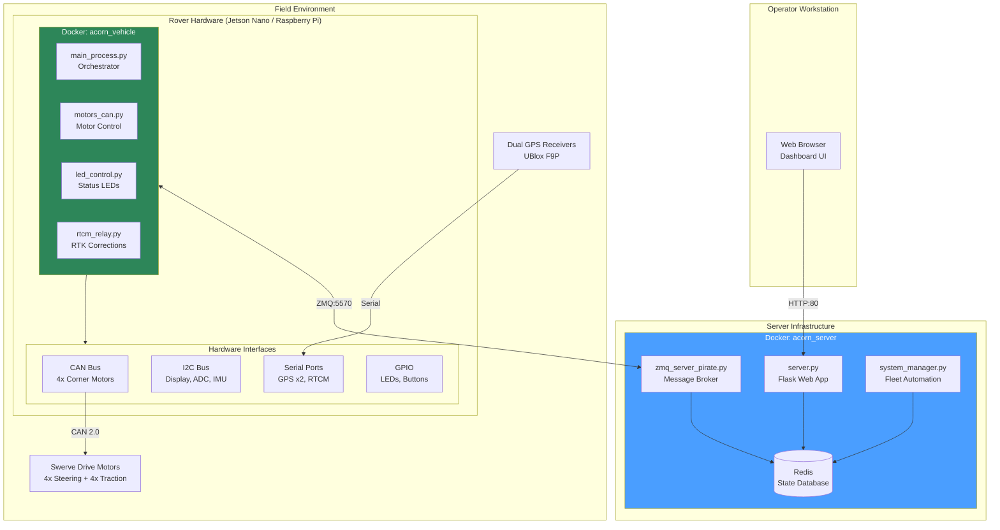
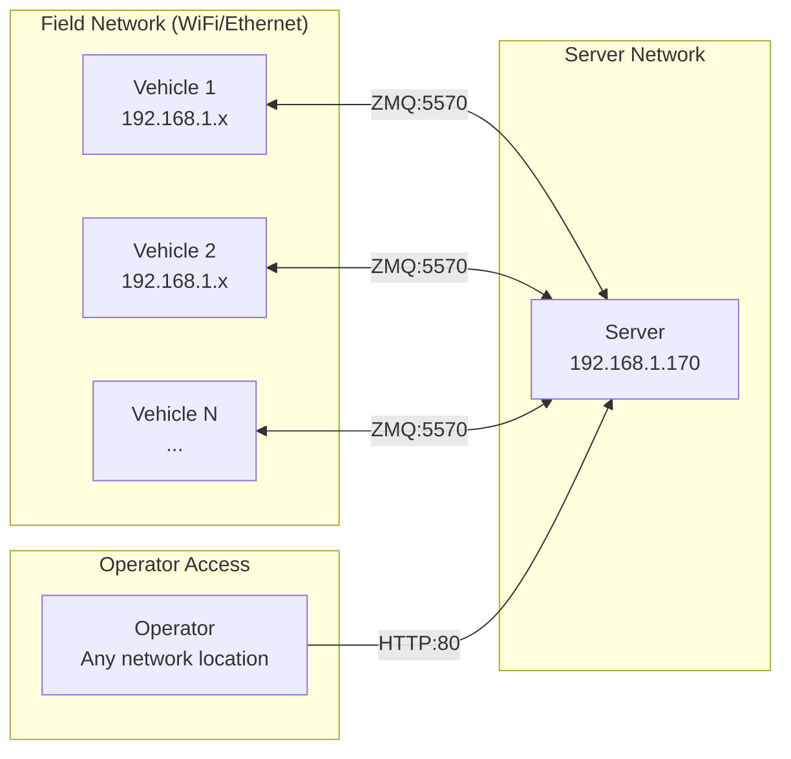

# Phase 1: System Context & Boundaries

## Overview

The Acorn Precision Farming Rover is an autonomous agricultural robot developed by Twisted Fields. It uses RTK-GPS guided navigation to follow pre-recorded paths for precision farming tasks. The system is split into two deployable components that communicate over a network.

---

## System Context Diagram (C4 Level 1)

This diagram shows the Acorn system as a black box and its relationships with external actors and systems.



### Simplified View (Standard Mermaid)



---

## External Actors & Interfaces

| Actor | Description | Interface | Protocol |
|-------|-------------|-----------|----------|
| **Operator** | Human farm operator monitoring/controlling the fleet | Web browser to Server | HTTP/REST + JSON |
| **GPS Satellites** | GNSS constellation (GPS, GLONASS, Galileo) | Dual UBlox receivers on Vehicle | L1/L2 RF via serial |
| **RTK Base Station** | Fixed GPS receiver providing correction data | Serial connection to Vehicle | RTCM 3.x protocol |
| **RC Controller** | Optional handheld transmitter for manual override | S.Bus receiver on Vehicle | S.Bus serial protocol |

---

## System Boundaries

### What's Inside the System

| Component | Responsibility | Deployment |
|-----------|----------------|------------|
| **Vehicle Software** | Motor control, GPS processing, autonomy, path following | Docker on rover (Jetson/RPi) |
| **Server Software** | State storage, command relay, web UI, fleet management | Docker on server machine |
| **Communication Layer** | Reliable messaging between vehicle and server | ZMQ over TCP/IP |

### What's Outside the System

| External System | Notes |
|-----------------|-------|
| GPS Infrastructure | Relies on external satellite constellation |
| RTK Base Station | May be a separate hardware unit or NTRIP service |
| Network Infrastructure | WiFi/Ethernet between vehicle and server |
| Power Systems | Battery pack, charging infrastructure |

---

## Deployment Diagram

This diagram shows how the system components are deployed across physical/virtual infrastructure.



---

## Docker Container Details

### Vehicle Container (`acorn_vehicle`)

| Attribute | Value |
|-----------|-------|
| **Base Image** | `ros:iron-ros-core-jammy` |
| **Working Directory** | `/home/acorn` |
| **Network Mode** | `host` (direct hardware access) |
| **Privileged** | `true` (required for CAN, GPIO, serial) |
| **Entry Point** | `vehicle/autolaunch_vehicle.sh` |
| **Key Volumes** | `/dev` (devices), code directory |

**Processes launched (via tmux):**
| Session | Command | Purpose |
|---------|---------|---------|
| `main` | `python3 main_process.py` | Central orchestrator |
| `motors` | `python3 motors_can.py` | CAN motor interface (restarts on crash) |
| `leds` | `python3 led_control.py` | LED status indicators |
| `rtcm` | `python3 rtcm_relay.py` | RTK correction relay |

### Server Container (`acorn_server`)

| Attribute | Value |
|-----------|-------|
| **Base Image** | `ros:iron-ros-core-jammy` |
| **Working Directory** | `/acorn/server` |
| **Network Mode** | Bridge with port mappings |
| **Environment** | `PYTHONPATH=/acorn/vehicle` (shared model) |
| **Entry Point** | `server/autolaunch_server.sh` |

**Exposed Ports:**
| Port | Service | Protocol |
|------|---------|----------|
| 80 | Flask Web UI | HTTP |
| 5570 | ZMQ Message Broker | ZMQ |
| 6379 | Redis | Redis protocol |
| 8123, 6799 | Reserved/Development | - |

**Processes launched (via tmux):**
| Session | Command | Purpose |
|---------|---------|---------|
| `redis` | `redis-server redis.conf` | State database |
| `zmq` | `python3 zmq_server_pirate.py` | Primary ZMQ broker |
| `zmq_ppq` | `python3 zmq_ppqueue.py` | Alternative queue broker |
| `web` | `python3 server.py` | Flask HTTP server |
| `system_manager` | `python3 system_manager.py` | Fleet automation |

---

## Configuration

### Vehicle Configuration (`vehicle/server_config.yaml`)

```yaml
vehicle_name: acorn1              # Unique identifier for this rover
server: 192.168.1.170:5570        # ZMQ server address
site: twistedfields               # Site/fleet namespace
```

### Simulation Configuration (`vehicle/server_config_sim.yaml`)

```yaml
vehicle_name: acorn1
server: 127.0.0.1:5570            # Localhost for simulation
site: twistedfields
```

The `site` parameter is used as a namespace prefix in Redis keys, allowing multiple sites/fleets to share the same server.

---

## Network Topology



---

## Key Observations

### Design Decisions Evident in the Code

1. **Docker for isolation**: Both vehicle and server run in Docker containers, allowing consistent deployment across different hardware.

2. **ROS base image but minimal ROS usage**: The Docker image is based on ROS Iron, but ROS messaging (topics/services) doesn't appear to be used. The ROS image provides convenient dependencies (scipy, numpy, etc.).

3. **Privileged containers**: Vehicle container needs raw hardware access (CAN, GPIO, serial), hence privileged mode and host network.

4. **Tmux for process management**: Both containers use tmux to manage multiple processes, allowing easy debugging via `tmux attach`.

5. **Crash resilience**: Motor control process runs in a `while true` loop to auto-restart on crashes.

6. **Shared model code**: Server sets `PYTHONPATH=/acorn/vehicle` to import `model.py` containing shared data structures.

### Questions Identified

1. **Why two ZMQ brokers?** Both `zmq_server_pirate.py` and `zmq_ppqueue.py` are started. Are they redundant? Load balanced? Different purposes?

2. **ROS integration**: Is ROS actually used, or is the base image just convenient for dependencies?

3. **Multi-vehicle support**: The architecture supports multiple vehicles per server, but how is this managed in practice?

4. **RTK base station**: How is the RTCM correction data currently delivered - direct serial or network relay?

---

## Next Steps

Phase 2 will dive into the internal components of the Vehicle and Server subsystems, documenting:
- Process boundaries and responsibilities
- Inter-process communication mechanisms
- Hardware interface abstractions
