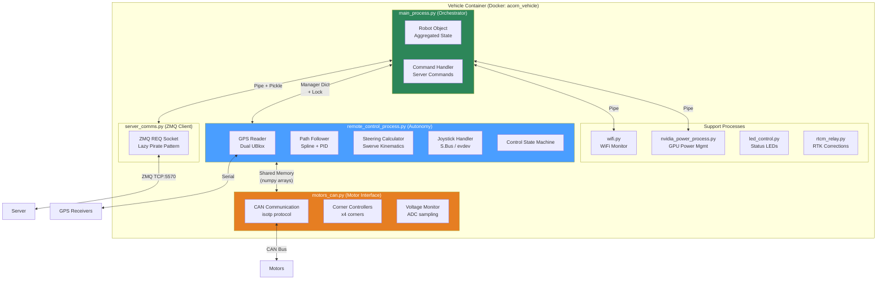
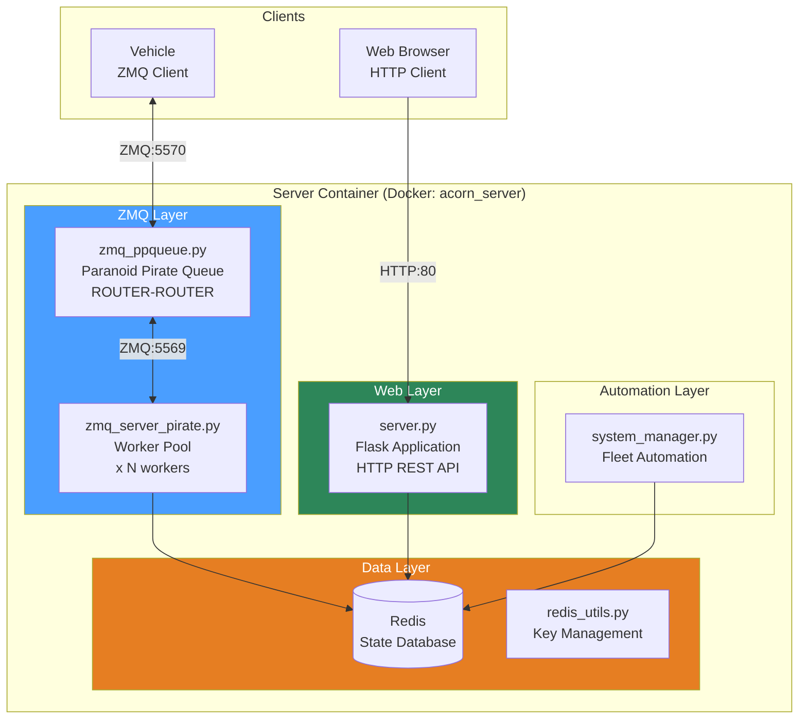
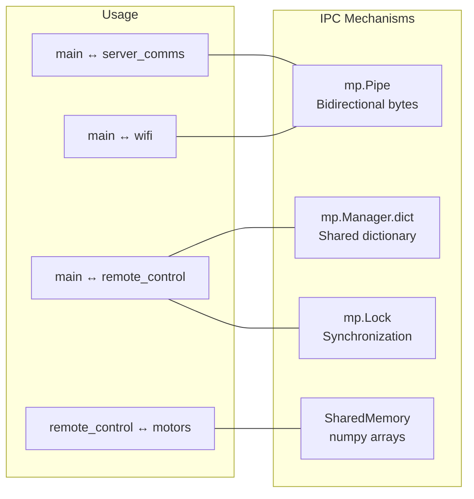

# Phase 2: Container/Component Architecture

## Overview

This document details the internal component structure of the Vehicle and Server subsystems, including process boundaries, inter-process communication mechanisms, and hardware interfaces.

---

## Vehicle Component Architecture

The vehicle software runs as multiple processes coordinated by `main_process.py`. These processes communicate via pipes, shared memory, and manager dictionaries.

### Vehicle Process Diagram



### Vehicle Process Details

#### 1. Main Process (`main_process.py`)

**Role**: Central orchestrator that coordinates all other processes and manages server communication.

**Key Responsibilities**:
- Aggregates state from all subsystems into `Robot` object
- Sends periodic state updates to server (every 2 sec, or 0.1 sec in simulation)
- Receives and dispatches commands from server
- Manages process lifecycle via `multiprocessing`

**IPC Mechanisms**:
| Target | Mechanism | Data Flow |
|--------|-----------|-----------|
| `server_comms.py` | `mp.Pipe()` | Bidirectional commands/state |
| `remote_control_process.py` | `mp.Manager().dict()` + `Lock` | Robot state ↔ control state |
| `wifi.py` | `mp.Pipe()` | WiFi strength, AP name, CPU temp |
| `nvidia_power_process.py` | `mp.Pipe()` | Vision/power state |

**Key Constants** (from `main_process.py`):
```python
_SIMULATION_UPDATE_PERIOD = 0.1        # seconds
_UPDATE_PERIOD = 2.0                   # seconds
_MAX_ALLOWED_SERVER_COMMS_OUTAGE_SEC = 60
_SERVER_CONNECT_TIME_LIMIT_MINUTES = 10
```

#### 2. Remote Control Process (`remote_control_process.py`)

**Role**: The autonomy brain - handles GPS reading, path following, and motor command generation.

**Key Responsibilities**:
- Reads GPS samples from dual UBlox receivers
- Calculates path-following errors (lateral, angular)
- Runs PID controllers for steering/strafe correction
- Handles joystick input for manual override
- Manages autonomy state machine
- Generates steering commands via swerve kinematics

**State Machine States** (from `model.py`):
```python
CONTROL_STARTUP = "Initializing..."
CONTROL_GPS_STARTUP = "Waiting for GPS fix."
CONTROL_ONLINE = "Online and awaiting commands."
CONTROL_AUTONOMY = "Autonomy operating."
CONTROL_AUTONOMY_PAUSE = "Temporary autonomy pause."
CONTROL_LOW_VOLTAGE = "Low voltage Pause."
CONTROL_AUTONOMY_ERROR_DISTANCE = "Autonomy failed - too far from path."
CONTROL_AUTONOMY_ERROR_ANGLE = "Autonomy failed - path angle too great."
CONTROL_AUTONOMY_ERROR_RTK_AGE = "Autonomy failed - rtk base data too old."
CONTROL_AUTONOMY_ERROR_SOLUTION_AGE = "Autonomy failed - gps solution too old."
CONTROL_OVERRIDE = "Remote control override."
```

**Key Constants** (from `remote_control_process.py`):
```python
_DEFAULT_TRAVEL_SPEED = 0.2                    # m/s
_DEFAULT_MAXIMUM_VELOCITY = 0.4                # m/s
_MAXIMUM_ALLOWED_DISTANCE_METERS = 2.5         # path error limit
_MAXIMUM_ALLOWED_ANGLE_ERROR_DEGREES = 120     # angle error limit
_VOLTAGE_CUTOFF = 25                           # volts
_ALLOWED_RTK_AGE_SEC = 20.0                    # RTK correction age limit
_ALLOWED_SOLUTION_AGE_SEC = 1.0                # GPS solution freshness
_DISENGAGEMENT_RETRY_DELAY_MINUTES = 1         # retry after error
_PATH_END_PAUSE_SEC = 5.0                      # pause at path end
ACCELERATION_COUNTS_SEC = 0.5                  # m/s² ramp rate
```

**PID Gains** (defaults):
```python
_DEFAULT_ANGULAR_P = 1.5
_DEFAULT_LATERAL_P = 0.25
_DEFAULT_ANGULAR_D = 0.3
_DEFAULT_LATERAL_D = 0.05
```

#### 3. Motor Process (`motors_can.py`)

**Role**: Low-level motor control via CAN bus, running in a separate process for timing reliability.

**Key Responsibilities**:
- Manages CAN communication with 4 corner motor controllers
- Handles steering homing and position control
- Monitors motor voltages, currents, temperatures
- Provides shared memory interface for steering commands

**Motor Connections** (from `motors_can.py`):
```python
motor_connections = [
    MotorConnection(name='front_left',  id=0x6, port="can1"),
    MotorConnection(name='front_right', id=0x7, port="can1"),
    MotorConnection(name='rear_left',   id=0x8, port="can1"),
    MotorConnection(name='rear_right',  id=0x9, port="can1"),
]
```

**Shared Memory Interface** (from `model.py`):
```python
# Output: motor state to remote_control
MOTOR_SAMPLE_OUTPUT = np.array([
    [state, control_flow, 0, 0],      # [0] state flags
    [v1, v2, v3, v4],                 # [1] voltages
    [i1, i2, i3, i4],                 # [2] bus currents
    [t1, t2, t3, t4],                 # [3] temperatures
    [enc0_0, enc0_1, enc0_2, enc0_3], # [4-7] encoder estimates
    ...
])

# Input: commands from remote_control
MOTOR_SAMPLE_INPUT = np.array([
    [steering_angle, velocity],  # front_left
    [steering_angle, velocity],  # front_right
    [steering_angle, velocity],  # rear_left
    [steering_angle, velocity],  # rear_right
    [flags, 0]                   # control flags
])
```

#### 4. Server Comms (`server_comms.py`)

**Role**: ZMQ client implementing Lazy Pirate reliability pattern.

**Protocol**:
- Socket type: `ZMQ.REQ` (request-reply)
- Pattern: Lazy Pirate (retry with socket recreation on timeout)
- Timeout: 4.5 seconds per request
- Retries: 30 attempts before giving up

**Message Format**:
```
[sequence_number, command, key, payload]
```

#### 5. GPS Module (`gps.py`)

**Role**: Interface to dual UBlox GPS receivers via pyubx2 library.

**Configuration**:
- Baud rate: 921,600
- Measurement rate: 40 Hz
- Navigation rate: 2 Hz (every 20th measurement)
- Ports: `/dev/ttySC0` (front), `/dev/ttySC1` (rear)

**Heading Calculation**: Derived from relative positions of front and rear GPS receivers.

#### 6. Steering Module (`steering.py`)

**Role**: Swerve drive kinematics calculator.

**Algorithm**: Chief Delphi 4-wheel independent steering math.

**Vehicle Geometry**:
```python
wheel_base_width = 1.83   # meters
wheel_base_length = 2.2   # meters
wheel_radius = 0.4        # meters
```

---

## Server Component Architecture

The server runs multiple independent services that communicate through Redis.

### Server Service Diagram



### Server Component Details

#### 1. ZMQ Queue (`zmq_ppqueue.py`)

**Role**: Paranoid Pirate queue broker - routes messages between vehicles and workers.

**Architecture**:
- Frontend: `ROUTER` socket on port 5570 (for vehicle clients)
- Backend: `ROUTER` socket on port 5569 (for workers)
- Pattern: LRU (Least Recently Used) worker routing

**Protocol Constants**:
```python
HEARTBEAT_LIVENESS = 3      # missed heartbeats before worker expires
HEARTBEAT_INTERVAL = 1.0    # seconds between heartbeats
PPP_READY = b"\x01"         # worker ready signal
PPP_HEARTBEAT = b"\x02"     # heartbeat signal
```

#### 2. ZMQ Workers (`zmq_server_pirate.py`)

**Role**: Worker processes that handle vehicle requests.

**Responsibilities**:
- Connect to queue backend (port 5569)
- Handle vehicle commands (write key, read key, update robot)
- Read/write to Redis
- Send heartbeats to queue

**Command Handling** (from `zmq_server.py`):
```python
_CMD_WRITE_KEY = b'w'           # Store data
_CMD_READ_KEY = b'readkey'      # Retrieve data
_CMD_READ_PATH_KEY = b'readpathkey'  # Load path
_CMD_UPDATE_ROBOT = b'ur'       # Push robot state
_CMD_ROBOT_COMMAND = b'rc'      # Return command to vehicle
_CMD_ACK = b'a'                 # Acknowledgment
```

#### 3. Flask Web Server (`server.py`)

**Role**: HTTP REST API and web UI serving.

**Key Endpoints**:
| Endpoint | Method | Purpose |
|----------|--------|---------|
| `/` | GET | Main dashboard (acorn.html) |
| `/api/get_herd_data` | GET | All robot states as JSON |
| `/api/get_path_names` | GET | List available paths |
| `/api/get_path/<name>` | GET | Get path points |
| `/api/save_path/<name>` | POST | Save new path |
| `/api/delete_path/<name>` | GET | Delete path |
| `/api/set_vehicle_path/<path>/<vehicle>` | GET | Assign path to vehicle |
| `/api/set_vehicle_autonomy/<vehicle>/<speed>/<enable>` | GET | Control autonomy |
| `/api/modify_autonomy_hold/<vehicle>/<value>` | GET | Clear autonomy hold |
| `/api/set_gps_recording/<vehicle>/<cmd>` | GET | Control GPS recording |
| `/api/get_dense_path` | GET | Get detailed path history |

#### 4. Redis Database

**Role**: Central state store using pickle serialization.

**Key Naming Convention**:
```
{site}:robot:{name}:key              # Robot state
{site}:robot:{name}:command:key      # Robot commands
{site}:robot:{name}:energy_segment:key  # Energy history (list)
{site}:gpspath:{pathname}:key        # Saved paths
{site}:gpspolygon:{name}:key         # Saved polygons
```

**Example** (for site="twistedfields", vehicle="acorn1"):
```
twistedfields:robot:acorn1:key
twistedfields:robot:acorn1:command:key
twistedfields:gpspath:field_row_1:key
```

#### 5. System Manager (`system_manager.py`)

**Role**: Autonomous fleet management - automatically enables autonomy when conditions are met.

**Logic Flow**:
1. Monitor robot data freshness (< 5 sec = online)
2. Wait for settling time (30 sec after coming online)
3. Check voltage threshold (> 40V)
4. Clear autonomy hold
5. Enable autonomy if state is `CONTROL_ONLINE`

**Key Constants**:
```python
AUTONOMY_AT_STARTUP = True
AUTONOMY_SPEED = 0.2                     # m/s
_ONLINE_DATA_AGE_MAXIMUM_SEC = 5         # freshness threshold
_ONLINE_SETTLING_TIME_SEC = 30           # wait before enabling
_RESUME_AUTONOMY_MINIMUM_VOLTAGE = 40    # voltage threshold
_MAXIMUM_TIME_TO_ATTEMPT_AUTONOMY_SEC = 36000  # 10 hours
```

---

## Inter-Process Communication Summary

### Vehicle IPC



| Source | Target | Mechanism | Data |
|--------|--------|-----------|------|
| main | server_comms | `Pipe` | Commands, robot state (pickle) |
| main | wifi | `Pipe` | WiFi stats |
| main | nvidia_power | `Pipe` | Power state |
| main | remote_control | `Manager.dict` + `Lock` | `RobotSubset` ↔ control tuple |
| remote_control | motors | `SharedMemory` | numpy arrays (steering cmds, feedback) |

### Server IPC

All server components communicate through Redis (no direct IPC):

| Source | Target | Via | Data |
|--------|--------|-----|------|
| ZMQ Worker | Redis | Direct | Robot state, commands |
| Flask | Redis | Flask-Redis | Same data via HTTP API |
| System Manager | Redis | Direct | Command modifications |

---

## Data Structures

### Robot Class (`model.py`)

```python
class Robot:
    # Identity
    name: str                    # "acorn1"
    server: str                  # "192.168.1.170:5570"
    site: str                    # "twistedfields"
    key: bytes                   # Redis key

    # Position/Navigation
    location: GpsSample          # Current GPS position
    loaded_path_name: str        # Active path key
    loaded_path: list            # Path points
    live_path_data: list         # Breadcrumb trail
    gps_path_data: list          # Recorded GPS path

    # Control State
    control_state: str           # CONTROL_* constant
    motor_state: int             # MOTOR_DISCONNECTED/DISABLED/ENABLED
    autonomy_hold: bool          # Autonomy blocked
    activate_autonomy: bool      # Autonomy requested
    autonomy_velocity: float     # Target speed (m/s)

    # Telemetry
    voltage: float               # Battery voltage
    speed: float                 # Current speed
    turn_intent_degrees: float   # Steering intent
    wifi_strength: float         # Signal strength
    cpu_temperature_c: float     # CPU temp
    motor_temperatures: list     # Per-motor temps

    # Debug/Diagnostics
    gps_distances: list          # Path error history
    gps_angles: list             # Angle error history
    strafeP, steerP: list        # PID P term history
    strafeD, steerD: list        # PID D term history
    debug_points: tuple          # Visualization points
```

### RobotCommand Class (`model.py`)

```python
class RobotCommand:
    load_path: str              # Path key to load
    activate_autonomy: bool     # Enable autonomy
    clear_autonomy_hold: bool   # Clear hold flag
    autonomy_velocity: float    # Target speed
    record_gps_path: str        # GPS_RECORDING_* constant
```

### GpsSample (`gps_tools.py`)

```python
GpsSample = namedtuple('GpsSample', [
    'lat',              # Latitude (degrees)
    'lon',              # Longitude (degrees)
    'height_m',         # Altitude (meters)
    'status',           # Tuple: ("fix"/"float"/"single", ...) for each GPS
    'num_sats',         # Satellite count (tuple for dual GPS)
    'azimuth_degrees',  # Heading (degrees, 0=North)
    'time_stamp',       # Unix timestamp or datetime
    'rtk_age'           # Age of RTK corrections (seconds)
])
```

---

## Key Observations

### Architecture Patterns

1. **Process Isolation**: Critical functions (motors, autonomy) run in separate processes for fault isolation and timing guarantees.

2. **Shared Memory for Performance**: Motor commands use numpy shared memory arrays for low-latency, high-frequency updates.

3. **Pickle Serialization**: All complex objects are pickled for IPC and Redis storage (not ideal for debugging or cross-language compatibility).

4. **Polling Pattern**: Main loop polls all sources rather than event-driven, simplifying synchronization.

5. **Redundant ZMQ**: Both `zmq_server.py` (threaded) and `zmq_ppqueue.py` + `zmq_server_pirate.py` (Paranoid Pirate) exist - the latter is the active implementation.

### Coupling Points

| Component A | Component B | Coupling |
|-------------|-------------|----------|
| main_process | model | Tight - shares Robot class |
| remote_control | model | Tight - shares constants, Robot |
| server.py | model | Tight - imports RobotCommand |
| All | pickle | Format coupling - object structure changes break stored data |

### Potential Issues Identified

1. **Bare except blocks**: Error handling often swallows exceptions silently
2. **Hardcoded paths**: Device paths like `/dev/ttySC0` are hardcoded
3. **Magic numbers**: Many numeric constants inline rather than configured
4. **Polling inefficiency**: Main loop polls even when no data is available
5. **State machine complexity**: `remote_control_process.py` mixes state machine, PID control, and I/O

---

## Next Steps

Phase 3 will trace data flows through the system:
- Robot state flow (sensors → aggregation → server → UI)
- Command flow (UI → server → vehicle → actuators)
- Autonomy control loop (GPS → error calculation → PID → steering)
