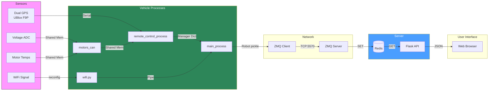
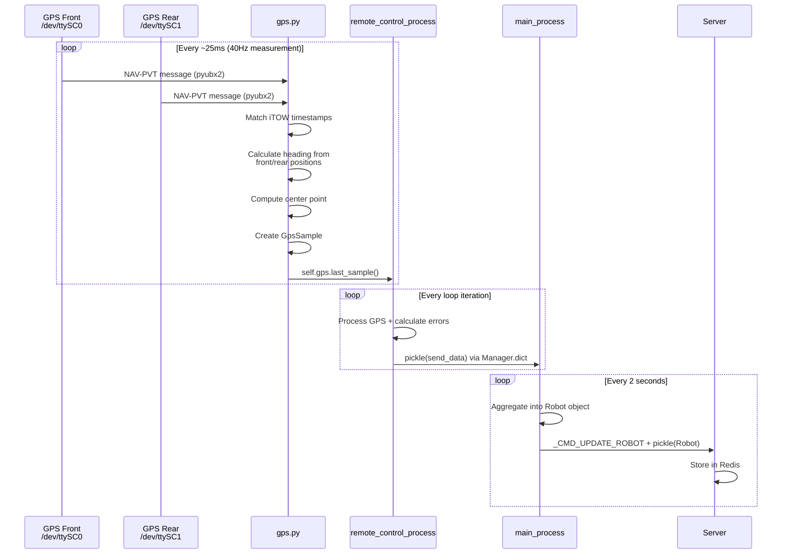
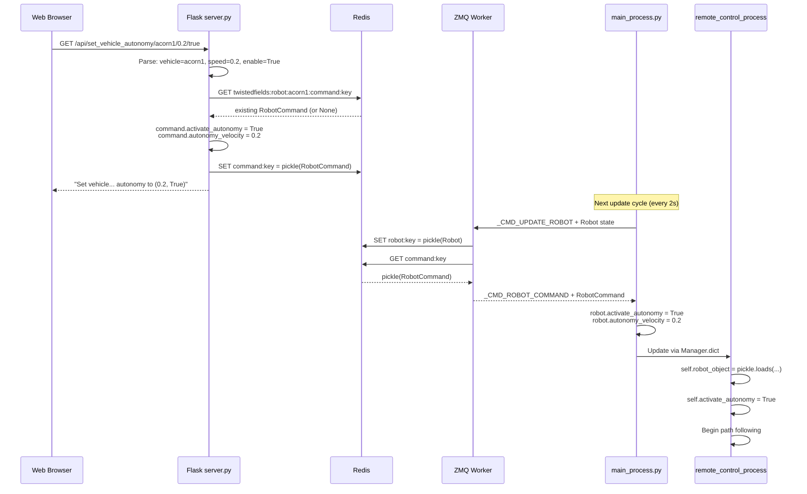
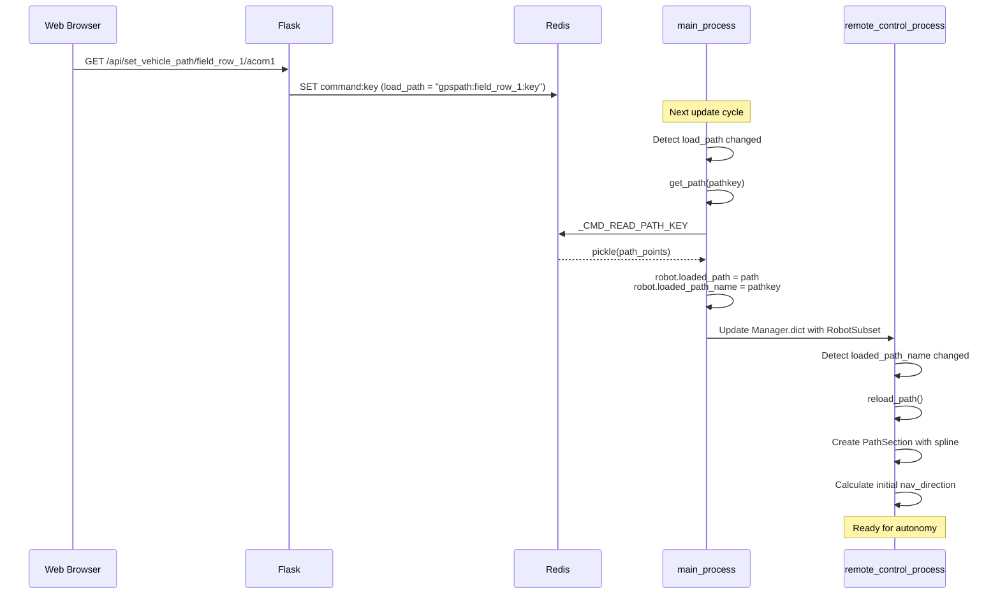
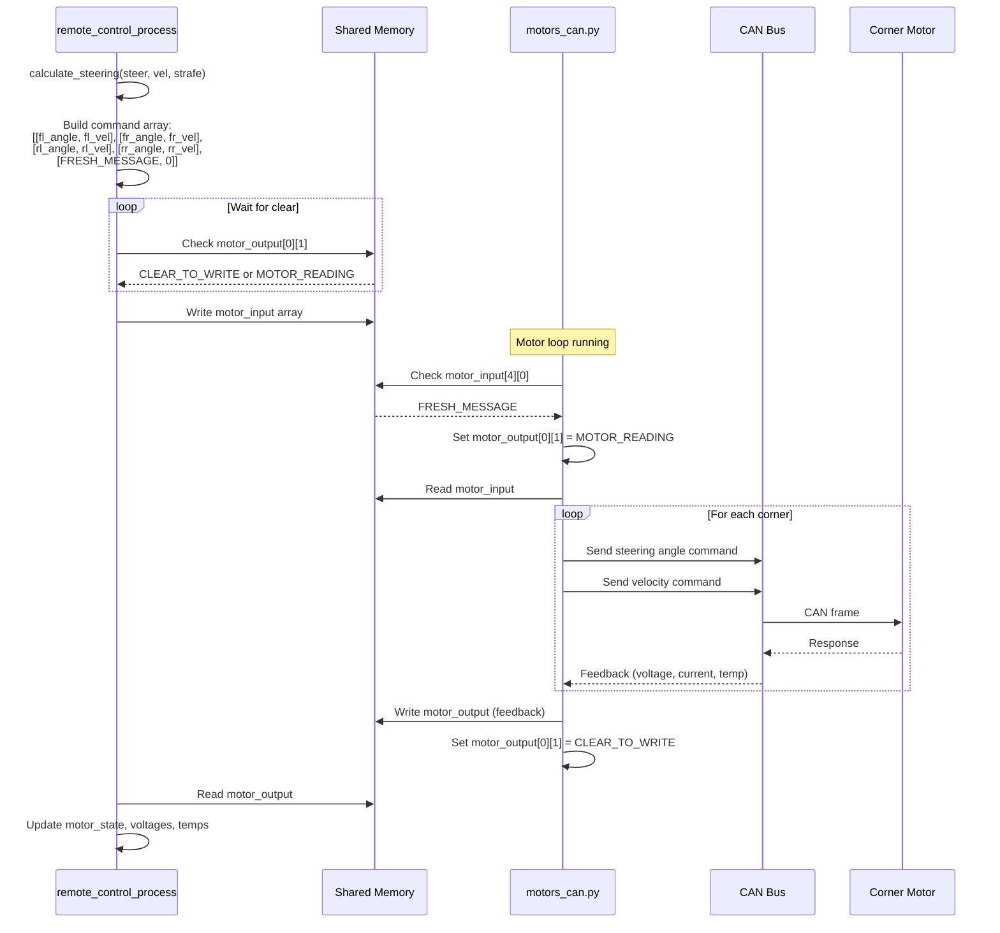

# Phase 3: Data Flow Diagrams

## Overview

This document traces how data moves through the Acorn system for three key operations:
1. **Robot State Flow**: Sensor data → aggregation → server → web UI
2. **Command Flow**: Web UI → server → vehicle → actuators
3. **Autonomy Control Loop**: GPS → path error → PID → steering → motors

---

## 1. Robot State Flow

### High-Level State Flow



### Detailed GPS Data Flow



### GPS Sample Structure

```
GpsSample (from gps.py:216-222)
├── lat: float              # Midpoint of front/rear GPS
├── lon: float              # Midpoint of front/rear GPS
├── height_m: float         # From front GPS hMSL
├── status: tuple           # (is_good_rtk_fix_front, is_good_rtk_fix_rear)
├── num_sats: tuple         # (front_numSV, rear_numSV)
├── azimuth_degrees: float  # get_heading(rear, front)
├── time_stamp: datetime    # From GPS NAV-PVT
└── rtk_age: float          # Age of RTK corrections
```

**Heading Calculation** (`gps_tools.get_heading()`):
- Heading = bearing from rear GPS receiver to front GPS receiver
- Uses WGS84 geodesic calculation

### Data Tuple from Remote Control to Main

From `remote_control_process.py:762-777`:
```python
send_data = (
    self.gps.last_sample(),           # [0] GpsSample
    points_to_send,                   # [1] Path points (for 1 sec after load)
    self.next_point_heading,          # [2] Target heading
    debug_points,                     # [3] (front, rear, projected, closest)
    self.control_state,               # [4] CONTROL_* string
    model.MOTOR_STATE_STRINGS[...],   # [5] Motor state string
    self.autonomy_hold,               # [6] bool
    self.gps_path_lateral_error,      # [7] Distance from path (m)
    self.gps_path_angular_error,      # [8] Angle from path (degrees)
    self.gps_path_lateral_error_rate(), # [9] Rate of change
    self.gps_path_angular_error_rate(), # [10] Rate of change
    strafe_p,                         # [11] PID P term
    steer_p,                          # [12] PID P term
    strafe_d,                         # [13] PID D term
    steer_d,                          # [14] PID D term
    user_web_page_plot_steer_cmd,     # [15] For UI display
    user_web_page_plot_strafe_cmd,    # [16] For UI display
    self.gps.is_dual_fix(),           # [17] Both GPS have fix
    self.voltage_average,             # [18] Battery voltage
    self.last_energy_segment,         # [19] Energy tracking
    self.temperatures,                # [20] Motor temperatures
    steering_debug                    # [21] Debug tuple
)
```

### Motor Feedback Flow (Shared Memory)

From `motors_can.py` to `remote_control_process.py`:

```
motor_output (shared memory array)
├── [0] [state, control_flow, 0, 0]    # Motor state flags
├── [1] [v1, v2, v3, v4]               # Voltages per corner
├── [2] [i1, i2, i3, i4]               # Bus currents per corner
├── [3] [t1, t2, t3, t4]               # Temperatures per corner
├── [4] [encoder estimates corner 0]
├── [5] [encoder estimates corner 1]
├── [6] [encoder estimates corner 2]
└── [7] [encoder estimates corner 3]
```

---

## 2. Command Flow

### High-Level Command Flow

```mermaid
flowchart RL
    subgraph UI["Web UI"]
        BTN[Button Click<br/>e.g., "Enable Autonomy"]
    end

    subgraph FLASK["Flask Server"]
        API["/api/set_vehicle_autonomy"]
        REDIS_W[redis_utils.py]
    end

    subgraph REDIS["Redis"]
        CMD_KEY["command:key"]
    end

    subgraph ZMQ["ZMQ Layer"]
        WORKER[ZMQ Worker]
        QUEUE[ZMQ Queue]
    end

    subgraph VEHICLE["Vehicle"]
        COMMS[server_comms.py]
        MAIN[main_process.py]
        RC[remote_control_process.py]
    end

    BTN -->|"HTTP GET"| API
    API -->|"pickle(RobotCommand)"| REDIS_W
    REDIS_W -->|"SET"| CMD_KEY

    COMMS -->|"Periodic poll"| QUEUE
    QUEUE -->|"Route"| WORKER
    WORKER -->|"GET command:key"| CMD_KEY
    WORKER -->|"_CMD_ROBOT_COMMAND"| COMMS
    COMMS -->|"Pipe"| MAIN
    MAIN -->|"Manager Dict"| RC

    style UI fill:#f9f,stroke:#333
    style FLASK fill:#4a9eff,color:#fff
    style VEHICLE fill:#2d8659,color:#fff
```

### Command Sequence: Enable Autonomy



### Command Structure: RobotCommand

```python
class RobotCommand:
    load_path: str = ""              # Path key to load (e.g., "twistedfields:gpspath:row1:key")
    activate_autonomy: bool = False  # Enable autonomous operation
    clear_autonomy_hold: bool = False # Clear error hold state
    autonomy_velocity: float = 0     # Target speed in m/s
    record_gps_path: str = "Clear"   # GPS_RECORDING_ACTIVATE/PAUSE/CLEAR
```

### Path Loading Flow



---

## 3. Autonomy Control Loop

### Control Loop Overview

```mermaid
flowchart TB
    subgraph INPUT["Inputs"]
        GPS[GPS Sample<br/>lat, lon, heading]
        PATH[Loaded Path<br/>spline points]
        CMD[Commands<br/>activate, velocity]
    end

    subgraph CALC["Calculations (steering.py)"]
        CLOSEST[Find closest point<br/>on path spline]
        ERRORS[Calculate errors:<br/>- lateral distance<br/>- angular difference]
        DIRECTION[Determine driving<br/>direction]
    end

    subgraph PID["PID Control"]
        P_TERM[P terms:<br/>strafe_p = error × lateral_P<br/>steer_p = error × angular_P]
        D_TERM[D terms:<br/>strafe_d = rate × lateral_D<br/>steer_d = rate × angular_D]
        SUM[Sum: steer = steer_p + steer_d<br/>strafe = strafe_p + strafe_d]
    end

    subgraph SAFETY["Safety Checks"]
        DIST_CHECK{Distance<br/>< 2.5m?}
        ANGLE_CHECK{Angle<br/>< 120°?}
        RTK_CHECK{RTK age<br/>< 20s?}
        VOLT_CHECK{Voltage<br/>> 25V?}
    end

    subgraph OUTPUT["Outputs"]
        SWERVE[Swerve Kinematics<br/>calculate_steering()]
        MOTORS[Motor Commands<br/>via Shared Memory]
    end

    GPS --> CLOSEST
    PATH --> CLOSEST
    CLOSEST --> ERRORS
    ERRORS --> DIRECTION

    ERRORS --> P_TERM
    ERRORS --> D_TERM
    P_TERM --> SUM
    D_TERM --> SUM

    CMD --> DIST_CHECK
    SUM --> DIST_CHECK
    DIST_CHECK -->|Yes| ANGLE_CHECK
    ANGLE_CHECK -->|Yes| RTK_CHECK
    RTK_CHECK -->|Yes| VOLT_CHECK
    VOLT_CHECK -->|Yes| SWERVE

    DIST_CHECK -->|No| ZERO[Zero Output]
    ANGLE_CHECK -->|No| ZERO
    RTK_CHECK -->|No| ZERO
    VOLT_CHECK -->|No| ZERO

    SWERVE --> MOTORS
```

### Detailed Autonomy Loop (run_single_loop)

```mermaid
flowchart TB
    START([Loop Start]) --> GPS_READ[Read GPS Sample<br/>gps.new_gps_sample()]

    GPS_READ --> READ_ROBOT[Read RobotSubset<br/>from Manager.dict]

    READ_ROBOT --> CHECK_PATH{Path loaded?}
    CHECK_PATH -->|No| WAIT[Wait for path]
    CHECK_PATH -->|Yes| STEERING_CALC[steering_calc():<br/>- Find closest point on spline<br/>- Calculate rotation error<br/>- Calculate lateral error]

    STEERING_CALC --> JOY_CHECK{Joystick<br/>active?}
    JOY_CHECK -->|Yes| MANUAL[Set CONTROL_OVERRIDE<br/>autonomy_hold = True]
    JOY_CHECK -->|No| AUTONOMY_CHECK{Autonomy<br/>enabled?}

    AUTONOMY_CHECK -->|No| ONLINE[Set CONTROL_ONLINE]
    AUTONOMY_CHECK -->|Yes| PID_CALC[calc_commands_for_autonomy():<br/>steer_p = rotation × angular_P<br/>strafe_p = lateral × lateral_P<br/>steer_d = angular_rate × angular_D<br/>strafe_d = lateral_rate × lateral_D]

    PID_CALC --> SAFETY[safety_checks():<br/>- Distance from path<br/>- Angle error<br/>- RTK age<br/>- Solution age<br/>- Voltage]

    SAFETY --> SAFE{All checks<br/>passed?}
    SAFE -->|No| DISENGAGE[zero_output = True<br/>Set error state]
    SAFE -->|Yes| DRIVE_CALC[calc_drive_commands():<br/>vel_cmd, steer_cmd, strafe_cmd]

    DRIVE_CALC --> PROFILE[Acceleration profiling<br/>get_profiled_velocity()]

    PROFILE --> SWERVE[calculate_steering():<br/>4-wheel angles + velocities]

    SWERVE --> SEND_MAIN[Send state to main_process<br/>via Manager.dict]

    SEND_MAIN --> SEND_MOTORS[communicate_to_motors_sharedmem()<br/>Write to shared memory]

    MANUAL --> SEND_MAIN
    ONLINE --> SEND_MAIN
    DISENGAGE --> SEND_MAIN
    WAIT --> SEND_MAIN

    SEND_MOTORS --> END([Loop End])
```

### Steering Calculation Detail

From `steering.py:165-322` (`steering_calc` function):

```python
# Step 1: Find closest point on path
if len(path.points) == 2:
    # Simple 2-point path: use endpoints
    closest_path_point = p0 or p1
    path_point_heading = get_heading(p0, p1)
else:
    # Spline path: find closest U parameter
    closest_u = spline.closestUOnSplinePointsNearU(gps_sample, last_u)
    closest_path_point = spline.coordAtU(closest_u)
    path_point_heading = degrees(spline.slopeRadiansAtU(closest_u))

# Step 2: Calculate angular error
calculated_rotation = path_point_heading - robot_heading
calculated_rotation = normalize_to_pm180(calculated_rotation)

# Step 3: Calculate lateral error
projected_point = project_point(closest_path_point, path_point_heading, 1.0m)
lateral_error = get_approx_distance_point_from_line(
    robot_position, closest_path_point, projected_point)
calculated_strafe = -1 * lateral_error

# Step 4: Determine driving direction
if vehicle_direction == EITHER:
    if abs(rotation) > 90:
        driving_direction = -1  # Reverse
        rotation -= sign(rotation) * 180
```

### PID Control Detail

From `remote_control_process.py:905-997`:

```python
# P terms
steer_p = calculated_rotation * angular_P      # Default: 1.5
strafe_p = calculated_strafe * lateral_P       # Default: 0.25

# D terms (rate of change damping)
steer_d = angular_error_rate * angular_D       # Default: 0.3
strafe_d = lateral_error_rate * lateral_D * -1 # Default: 0.05

# Combined commands
steer_command = steer_p + steer_d
strafe_command = strafe_p + strafe_d

# Limits
steer_command = clamp(steer_command, -45, 45) / 45.0  # Normalize to [-1, 1]
strafe_command = clamp(strafe_command, -0.25, 0.25)

# Rate limiting
steer_cmd = clamp(steer_cmd, last_steer - 1.0, last_steer + 1.0)
strafe_cmd = clamp(strafe_cmd, last_strafe - 4.0, last_strafe + 4.0)

# Velocity command
vel_cmd = AUTONOMY_FACTOR * travel_speed * direction * drive_reverse
# AUTONOMY_FACTOR = 3.0, travel_speed default = 0.2 m/s
```

### Swerve Kinematics (calculate_steering)

From `steering.py:66-125`:

```python
def calculate_steering(steer, throttle, strafe):
    """
    Chief Delphi 4-wheel independent steering algorithm

    Inputs:
        steer: rotation command [-1, 1]
        throttle: forward/reverse velocity command
        strafe: lateral movement command

    Returns:
        dict with per-corner (steering_angle, velocity):
        {
            "front_right": (angle_rad, velocity),
            "front_left": (angle_rad, velocity),
            "rear_right": (angle_rad, velocity),
            "rear_left": (angle_rad, velocity)
        }
    """
    L = 2.2   # wheel_base_length (m)
    W = 1.83  # wheel_base_width (m)
    R = sqrt(L*L + W*W)

    RCW = steer * throttle  # Rotation component
    FWD = throttle          # Forward component
    STR = strafe            # Strafe component

    # Chief Delphi equations
    A = STR - RCW * (L/R)
    B = STR + RCW * (L/R)
    C = FWD - RCW * (W/R)
    D = FWD + RCW * (W/R)

    # Wheel speeds (magnitude)
    ws_fr = sqrt(B*B + C*C) * throttle_factor
    ws_fl = sqrt(B*B + D*D) * throttle_factor
    ws_rl = sqrt(A*A + D*D) * throttle_factor
    ws_rr = sqrt(A*A + C*C) * throttle_factor

    # Wheel angles
    wa_fr = atan2(B, C)
    wa_fl = atan2(B, D)
    wa_rl = atan2(A, D)
    wa_rr = atan2(A, C)
```

### Motor Command Flow (Shared Memory)



---

## Data Flow Timing Summary

| Flow | Rate | Latency | Notes |
|------|------|---------|-------|
| GPS measurement | 40 Hz | ~25ms | Hardware rate |
| GPS navigation solution | 2 Hz | ~500ms | Every 20th measurement |
| Remote control loop | ~30 Hz sim, variable real | ~33ms | Limited by GPS |
| Motor commands | Matches control loop | ~1ms | Shared memory |
| Main→Server update | 0.5 Hz (2s) | Variable | Network dependent |
| Server→Main commands | Piggybacks on update | ~2s | Polled with state update |
| Web UI refresh | ~1 Hz | ~1s | JavaScript polling |

---

## Key Observations

### Data Serialization Points

| Location | Format | Size | Notes |
|----------|--------|------|-------|
| RC ↔ Main | pickle | ~1-5 KB | Tuple with GPS, errors, debug |
| Main ↔ Server | pickle | ~10-50 KB | Full Robot object |
| Redis storage | pickle | Variable | Not human-readable |
| Flask → Browser | JSON | ~2-5 KB | Converted from pickle |

### Bottlenecks Identified

1. **Server update rate (2s)**: Commands take up to 2 seconds to reach vehicle
2. **Pickle deserialization**: Called on every loop iteration
3. **GPS serial catchup**: Can fall behind if CPU is loaded
4. **Redis polling**: No push notification, polling only

### Error Handling Gaps

1. **GPS failures**: Handled but sometimes silently swallowed
2. **CAN bus errors**: Motor process auto-restarts on crash
3. **Network failures**: 60s timeout before autonomy hold
4. **Redis connection**: No retry logic in Flask

---

## Next Steps

Phase 4 will document the interfaces between components:
- IPC interface specifications
- ZMQ protocol details
- HTTP API reference
- CAN bus message formats
