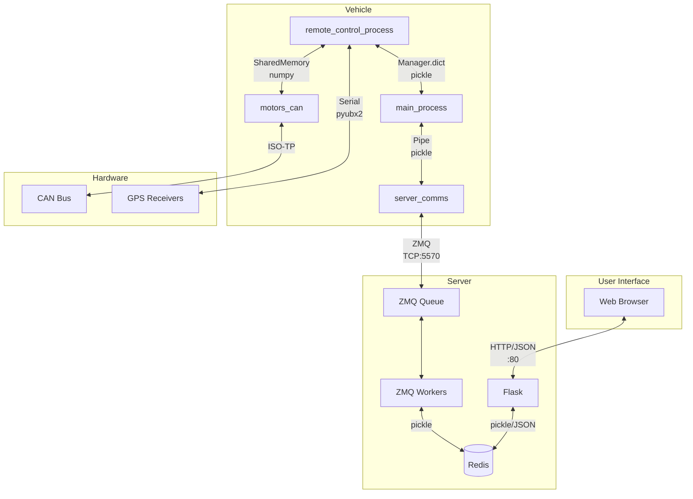

# Phase 4: Interface Documentation

## Overview

This document specifies the interfaces between components:
1. **IPC Interfaces** - Inter-process communication within the vehicle
2. **ZMQ Protocol** - Vehicle-to-server communication
3. **HTTP API** - Web UI to server
4. **CAN Bus Protocol** - Motor controller communication

---

## 1. IPC Interfaces (Vehicle)

### 1.1 Pipe Interfaces

#### Main ↔ Server Comms Pipe

**Direction**: Bidirectional
**Mechanism**: `multiprocessing.Pipe()`
**Format**: Pickled tuples

**Main → Server Comms (Commands)**:
```python
# Write key
(sequence_num: int, _CMD_WRITE_KEY: bytes, key: bytes, data: bytes)

# Read key
(sequence_num: int, _CMD_READ_KEY: bytes, key: bytes, b'')

# Update robot state
(sequence_num: int, _CMD_UPDATE_ROBOT: bytes, robot_key: bytes, pickle(Robot))

# Read path
(sequence_num: int, _CMD_READ_PATH_KEY: bytes, path_key: bytes, b'')
```

**Server Comms → Main (Responses)**:
```python
# Acknowledgment
(_CMD_ACK: bytes, b'ok')

# Read reply
(_CMD_READ_KEY_REPLY: bytes, pickle((key, value)))

# Robot command
(_CMD_ROBOT_COMMAND: bytes, pickle(RobotCommand))
```

**Command Constants** (from `main_process.py`):
```python
_CMD_WRITE_KEY = b'w'
_CMD_READ_KEY = b'readkey'
_CMD_READ_PATH_KEY = b'readpathkey'
_CMD_UPDATE_ROBOT = b'ur'
_CMD_ACK = b'a'
_CMD_READ_KEY_REPLY = b'readkeyreply'
_CMD_ROBOT_COMMAND = b'rc'
```

#### Main ↔ WiFi Pipe

**Direction**: WiFi → Main (one-way data)
**Mechanism**: `multiprocessing.Pipe()`
**Format**: Tuple

```python
# WiFi → Main
(wifi_strength: float,    # Signal strength in dBm
 access_point_name: str,  # Connected AP SSID
 cpu_temperature: float)  # CPU temperature in Celsius
```

#### Main ↔ Nvidia Power Pipe

**Direction**: Bidirectional
**Mechanism**: `multiprocessing.Pipe()`
**Format**: Application-specific

---

### 1.2 Manager Dict Interface

#### Main ↔ Remote Control

**Mechanism**: `multiprocessing.Manager().dict()` + `Lock`
**Keys**: Two string keys for bidirectional data

**Main → Remote Control** (`main_to_remote_string`):
```python
{
    "value": pickle.dumps(RobotSubset(
        loaded_path_name: str,         # Current path key
        loaded_path: list,             # Path points
        activate_autonomy: bool,       # Autonomy enabled
        autonomy_velocity: float,      # Target speed (m/s)
        record_gps_path: str,          # GPS_RECORDING_* constant
        wifi_strength: float,          # From WiFi process
        wifi_ap_name: str,             # From WiFi process
        cpu_temperature_c: float,      # CPU temp
        last_server_communication_stamp: float,  # Unix timestamp
        key: bytes                     # Redis key
    ))
}
```

**Remote Control → Main** (`remote_to_main_string`):
```python
{
    "value": pickle.dumps((
        gps_sample: GpsSample,              # [0] Current GPS
        path_points: list,                  # [1] Loaded path (1 sec after load)
        next_point_heading: float,          # [2] Target heading
        debug_points: tuple,                # [3] (front, rear, projected, closest)
        control_state: str,                 # [4] CONTROL_* constant
        motor_state_string: str,            # [5] "Disconnected"/"Disabled"/"Enabled"
        autonomy_hold: bool,                # [6] Autonomy blocked
        gps_path_lateral_error: float,      # [7] Distance from path (m)
        gps_path_angular_error: float,      # [8] Angle error (degrees)
        lateral_error_rate: float,          # [9] Rate of change
        angular_error_rate: float,          # [10] Rate of change
        strafe_p: float,                    # [11] PID P term
        steer_p: float,                     # [12] PID P term
        strafe_d: float,                    # [13] PID D term
        steer_d: float,                     # [14] PID D term
        plot_steer_cmd: float,              # [15] For UI
        plot_strafe_cmd: float,             # [16] For UI
        is_dual_fix: bool,                  # [17] Both GPS have fix
        voltage_average: float,             # [18] Battery voltage
        energy_segment: EnergySegment,      # [19] Energy tracking (or None)
        temperatures: list,                 # [20] Motor temps [t1, t2, t3, t4]
        steering_debug: tuple               # [21] Debug data
    ))
}
```

**Synchronization**:
```python
# Writing (with lock)
with self.remote_to_main_lock:
    self.remote_to_main_string["value"] = pickle.dumps(send_data)

# Reading (with lock)
with self.remote_to_main_lock:
    data = pickle.loads(self.remote_to_main_string["value"])
```

---

### 1.3 Shared Memory Interface

#### Remote Control ↔ Motors

**Mechanism**: `multiprocessing.shared_memory.SharedMemory`
**Format**: numpy arrays
**Names**: `motor_input_sharedmem`, `motor_output_sharedmem`

**Motor Input (Remote Control → Motors)**:
```python
# Shape: (5, 2) float64
MOTOR_SAMPLE_INPUT = np.array([
    [steering_angle_rad, velocity],  # [0] front_left
    [steering_angle_rad, velocity],  # [1] front_right
    [steering_angle_rad, velocity],  # [2] rear_left
    [steering_angle_rad, velocity],  # [3] rear_right
    [message_flag, 0]                # [4] control flags
], dtype=np.float64)

# Message flags
FRESH_MESSAGE = 1    # New data available
STALE_MESSAGE = 0    # Data has been read
```

**Motor Output (Motors → Remote Control)**:
```python
# Shape: (8, 4) float64
MOTOR_SAMPLE_OUTPUT = np.array([
    [motor_state, control_flow, 0, 0],      # [0] State flags
    [v1, v2, v3, v4],                       # [1] Voltages per corner
    [i1, i2, i3, i4],                       # [2] Bus currents
    [t1, t2, t3, t4],                       # [3] Temperatures
    [enc0_0, enc0_1, enc0_2, enc0_3],       # [4] Corner 0 encoder
    [enc1_0, enc1_1, enc1_2, enc1_3],       # [5] Corner 1 encoder
    [enc2_0, enc2_1, enc2_2, enc2_3],       # [6] Corner 2 encoder
    [enc3_0, enc3_1, enc3_2, enc3_3],       # [7] Corner 3 encoder
], dtype=np.float64)

# Control flow flags
MOTOR_READING = 1      # Motors are reading input
CLEAR_TO_WRITE = 0     # Safe to write new input

# Motor state values
MOTOR_DISCONNECTED = 0
MOTOR_DISABLED = 1
MOTOR_ENABLED = 2
```

**Synchronization Protocol**:
```
Remote Control:                    Motors:
    |                                  |
    | Wait for CLEAR_TO_WRITE          |
    |<---------------------------------|
    | Write motor_input                |
    |--------------------------------->|
    |                                  | Set MOTOR_READING
    |                                  | Read motor_input
    |                                  | Send CAN commands
    |                                  | Receive CAN feedback
    |                                  | Write motor_output
    |                                  | Set CLEAR_TO_WRITE
    | Read motor_output                |
    |<---------------------------------|
```

---

## 2. ZMQ Protocol

### 2.1 Architecture

```
Vehicle                           Server
┌─────────────┐                 ┌─────────────────┐
│ server_comms│                 │  zmq_ppqueue.py │
│  (REQ)      │◄───TCP:5570────►│  (ROUTER)       │
│             │                 │       │         │
└─────────────┘                 │       ▼         │
                                │  TCP:5569       │
                                │       │         │
                                │       ▼         │
                                │ zmq_server_     │
                                │ pirate.py       │
                                │  (DEALER)       │
                                └─────────────────┘
```

### 2.2 Message Format

**Request (Vehicle → Server)**:
```
Frame 0: sequence_number (4 bytes, big-endian int)
Frame 1: command (bytes)
Frame 2: key (bytes)
Frame 3: payload (bytes, often pickled object)
```

**Response (Server → Vehicle)**:
```
Frame 0: return_command (bytes)
Frame 1: reply_payload (bytes)
```

### 2.3 Commands

| Command | Bytes | Request Payload | Response |
|---------|-------|-----------------|----------|
| `_CMD_WRITE_KEY` | `b'w'` | Raw data | `_CMD_ACK` + `b'ok'` |
| `_CMD_READ_KEY` | `b'readkey'` | Empty | `_CMD_READ_KEY_REPLY` + pickle((key, value)) |
| `_CMD_READ_PATH_KEY` | `b'readpathkey'` | Empty | `_CMD_READ_KEY_REPLY` + pickle((key, path_data)) |
| `_CMD_UPDATE_ROBOT` | `b'ur'` | pickle(Robot) | `_CMD_ROBOT_COMMAND` + pickle(RobotCommand) |

### 2.4 Lazy Pirate Pattern (Client)

From `server_comms.py`:

```python
REQUEST_TIMEOUT = 4500      # milliseconds
REQUEST_RETRIES = 30        # attempts before giving up

def send(request):
    sequence = next_sequence()
    for attempt in range(REQUEST_RETRIES):
        socket.send_multipart([sequence, *request])

        if socket.poll(REQUEST_TIMEOUT):
            reply = socket.recv_multipart()
            if reply[0] == sequence:  # Verify sequence
                return reply[1:]
            # Wrong sequence - discard

        # Timeout - recreate socket
        socket.close()
        socket = create_new_socket()

    raise ConnectionError("Server unreachable")
```

### 2.5 Paranoid Pirate Pattern (Server)

**Queue Broker** (`zmq_ppqueue.py`):
- Frontend: ROUTER on port 5570 (clients)
- Backend: ROUTER on port 5569 (workers)
- LRU worker routing
- Heartbeat monitoring (1 second interval)
- Worker expiry (3 missed heartbeats)

**Worker** (`zmq_server_pirate.py`):
- DEALER socket connecting to backend
- Sends `PPP_READY` on startup
- Sends `PPP_HEARTBEAT` every second
- Reconnects on heartbeat failure

```python
PPP_READY = b"\x01"      # Worker ready signal
PPP_HEARTBEAT = b"\x02"  # Heartbeat signal
HEARTBEAT_LIVENESS = 3   # Missed heartbeats before reconnect
HEARTBEAT_INTERVAL = 1.0 # Seconds
```

---

## 3. HTTP API Reference

### 3.1 Base URL

```
http://<server_ip>:80/api/
```

### 3.2 Endpoints

#### Robot State

| Endpoint | Method | Description |
|----------|--------|-------------|
| `/api/get_herd_data` | GET | Get all robot states |

**Response** (`/api/get_herd_data`):
```json
[
  {
    "name": "acorn1",
    "lat": 37.353039,
    "lon": -122.333725,
    "heading": 45.2,
    "speed": 0.2,
    "voltage": 42.5,
    "control_state": "Autonomy operating.",
    "motor_state": "Enabled",
    "time_stamp": "2024-01-15T10:30:00",
    "loaded_path_name": "field_row_1",
    "autonomy_hold": false,
    "activate_autonomy": true,
    "wifi_signal": -65,
    "access_point_name": "FarmWiFi",
    "gps_distances": [0.1, 0.15, 0.12],
    "gps_angles": [2.5, 3.0, 2.8],
    "strafeP": [0.02, 0.03],
    "steerP": [0.05, 0.04],
    "live_path_data": [{"lat": 37.353, "lon": -122.333}, ...],
    "gps_path_data": [{"lat": 37.354, "lon": -122.334}, ...],
    "simulated_data": false
  }
]
```

#### Path Management

| Endpoint | Method | Description |
|----------|--------|-------------|
| `/api/get_path_names` | GET | List all saved paths |
| `/api/get_path/<name>` | GET | Get path points |
| `/api/save_path/<name>` | POST | Save new path |
| `/api/delete_path/<name>` | GET | Delete path |

**Request** (`/api/save_path/<name>`):
```json
[
  {"lat": 37.353039, "lon": -122.333725},
  {"lat": 37.353140, "lon": -122.333826},
  ...
]
```

**Response** (`/api/get_path_names`):
```json
["field_row_1", "field_row_2", "orchard_path"]
```

#### Vehicle Control

| Endpoint | Method | Description |
|----------|--------|-------------|
| `/api/set_vehicle_path/<path>/<vehicle>` | GET | Load path on vehicle |
| `/api/set_vehicle_autonomy/<vehicle>/<speed>/<enable>` | GET | Enable/disable autonomy |
| `/api/modify_autonomy_hold/<vehicle>/<value>` | GET | Clear autonomy hold |
| `/api/set_gps_recording/<vehicle>/<cmd>` | GET | Control GPS recording |

**Examples**:
```
# Load path "field_row_1" on vehicle "acorn1"
GET /api/set_vehicle_path/field_row_1/acorn1

# Enable autonomy at 0.2 m/s
GET /api/set_vehicle_autonomy/acorn1/0.2/true

# Disable autonomy
GET /api/set_vehicle_autonomy/acorn1/0/false

# Clear autonomy hold
GET /api/modify_autonomy_hold/acorn1/true

# Start GPS recording
GET /api/set_gps_recording/acorn1/Record

# Pause GPS recording
GET /api/set_gps_recording/acorn1/Pause

# Clear GPS recording
GET /api/set_gps_recording/acorn1/Clear
```

#### Polygon Management

| Endpoint | Method | Description |
|----------|--------|-------------|
| `/api/save_polygon/<name>` | POST | Save polygon |

#### Dense Path (Energy Tracking)

| Endpoint | Method | Description |
|----------|--------|-------------|
| `/api/get_dense_path` | GET | Get detailed path history |

#### Static Assets

| Endpoint | Method | Description |
|----------|--------|-------------|
| `/api/getRobotIcon` | GET | Robot icon SVG path data |
| `/api/getArrowIcon` | GET | Arrow icon SVG path data |
| `/api/robot.svg` | GET | Robot SVG file |

---

## 4. CAN Bus Protocol

### 4.1 Physical Layer

- **Bus**: CAN 2.0B
- **Interface**: `can1` (Linux SocketCAN)
- **Protocol**: ISO-TP (ISO 15765-2) via `python-can-isotp`
- **Addressing**: Each corner has unique TX ID

### 4.2 Corner Addresses

| Corner | Name | CAN TX ID | CAN RX ID |
|--------|------|-----------|-----------|
| Front Left | `front_left` | 0x06 | 0x01 |
| Front Right | `front_right` | 0x07 | 0x01 |
| Rear Left | `rear_left` | 0x08 | 0x01 |
| Rear Right | `rear_right` | 0x09 | 0x01 |

### 4.3 Message Types

```python
class MessageType(Enum):
    SEND_COMPLETE_SETTINGS = 1    # Full motor configuration
    REQUEST_COMPLETE_SETTINGS = 2 # Request all settings
    SEND_BASIC_UPDATE = 3         # Motor setpoints only
    REQUEST_SENSORS = 4           # Request sensor data
    REQUEST_HOMING = 5            # Start homing sequence
    SIMPLEFOC_PASS_THROUGH = 6    # Raw SimpleFOC command
    FIRMWARE_UPDATE = 7           # Firmware update (CPU1)
    FIRMWARE_UPDATE_CPU2 = 8      # Firmware update (CPU2)
    SIMPLE_PING = 9               # Connectivity check
    LOG_REQUEST = 10              # Request log data
    RAW_BRIDGE_COMMAND = 11       # Direct bridge control
    FIRMWARE_STATUS = 12          # Firmware version info
    SET_STEERING_HOME = 13        # Set home position
    CLEAR_ERRORS = 14             # Clear error codes
```

### 4.4 Message Formats

#### SIMPLE_PING (0x09)

**Request**:
```
Byte 0: 0x09 (MessageType.SIMPLE_PING)
```

**Response**:
```
Byte 0: Controller ID
Byte 1: 0x09 (MessageType)
Byte 2: Acknowledgment flags
        Bits 0-3: CAN CPU ack
        Bits 4-7: Motor CPU ack
```

#### REQUEST_SENSORS (0x04)

**Request**:
```
Byte 0: 0x04 (MessageType.REQUEST_SENSORS)
```

**Response** (38 bytes):
```
Byte 0:     Controller ID
Byte 1:     0x04 | flags
Byte 2-3:   ADC1 (steering pot) - uint16 LE
Byte 4-5:   ADC2 (home sensor) - uint16 LE
Byte 6:     Status flags
            Bit 0: AUX1
            Bit 1: AUX2
            Bit 2: motion_allowed
Byte 7:     Bridge 1 temperature (°C)
Byte 8:     Bridge 2 temperature (°C)
Byte 9:     Motor 1 temperature (°C)
Byte 10:    Motor 2 temperature (°C)
Byte 11-14: Voltage (float32 LE)
Byte 15-18: Current (float32 LE)
Byte 19-22: Motor voltage (float32 LE)
Byte 23-26: Motor 2 encoder counts (int32 LE)
Byte 27-30: Motor 1 steering angle (float32 LE, radians)
Byte 31-34: Motor 2 encoder velocity (float32 LE)
Byte 35:    Error codes
Byte 36-37: CRC16 (LE)
```

#### SEND_BASIC_UPDATE (0x03)

**Request**:
```
Byte 0:     0x03 | (reply_requested ? 0x40 : 0)
Byte 1-4:   Motor 1 setpoint (float32 LE) - steering angle
Byte 5-8:   Motor 2 setpoint (float32 LE) - traction velocity
```

#### SET_STEERING_HOME (0x0D)

**Request**:
```
Byte 0:     0x0D (MessageType.SET_STEERING_HOME)
Byte 1-4:   Home position (float32 LE, radians)
```

### 4.5 Error Codes

```python
ERROR_CODE_MOTOR1_OVERSPEED = 0x01
ERROR_CODE_INVALID_SPEED_COMMAND = 0x02
ERROR_CODE_INCONSISTENT_COMMS = 0x04
ERROR_CODE_INDUCTION_ENCODER_OFFLINE = 0x08
```

### 4.6 Conversion Factors

```python
# Steering angle conversion
STEERING_RADIANS_TO_COUNTS = 1024.0 * 0.43  # ~440
STEERING_COUNTS_TO_RADIANS = 1.0 / STEERING_RADIANS_TO_COUNTS

# ADC voltage conversion
ADC_TO_VOLTS = 3.3 / 1024  # 10-bit ADC, 3.3V reference
```

### 4.7 Thermal Limits

```python
THERMAL_WARNING_LIMIT = 60   # °C - trigger warning
THERMAL_SHUTDOWN_LIMIT = 100 # °C - disable motor
```

---

## 5. Redis Key Schema

### 5.1 Key Format

```
{site}:{type}:{name}:{suffix}
```

### 5.2 Key Types

| Pattern | Description | Value Type |
|---------|-------------|------------|
| `{site}:robot:{name}:key` | Robot state | pickle(Robot) |
| `{site}:robot:{name}:command:key` | Robot commands | pickle(RobotCommand) |
| `{site}:robot:{name}:energy_segment:key` | Energy history | List of pickle(EnergySegment) |
| `{site}:gpspath:{pathname}:key` | Saved GPS path | pickle(list of points) |
| `{site}:gpspolygon:{name}:key` | Saved polygon | pickle(polygon data) |

### 5.3 Example Keys

```
twistedfields:robot:acorn1:key
twistedfields:robot:acorn1:command:key
twistedfields:robot:acorn1:energy_segment:key
twistedfields:gpspath:field_row_1:key
twistedfields:gpspolygon:north_field:key
```

---

## 6. Interface Diagram



---

## Next Steps

Phase 5 will document the state machines:
- Vehicle control states and transitions
- Motor states
- Autonomy behavioral logic
