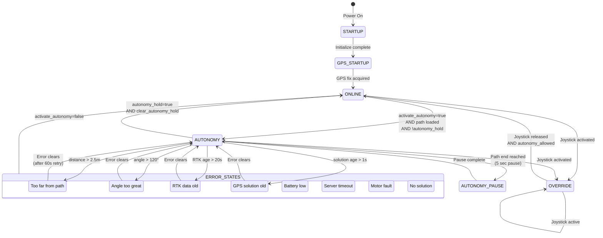
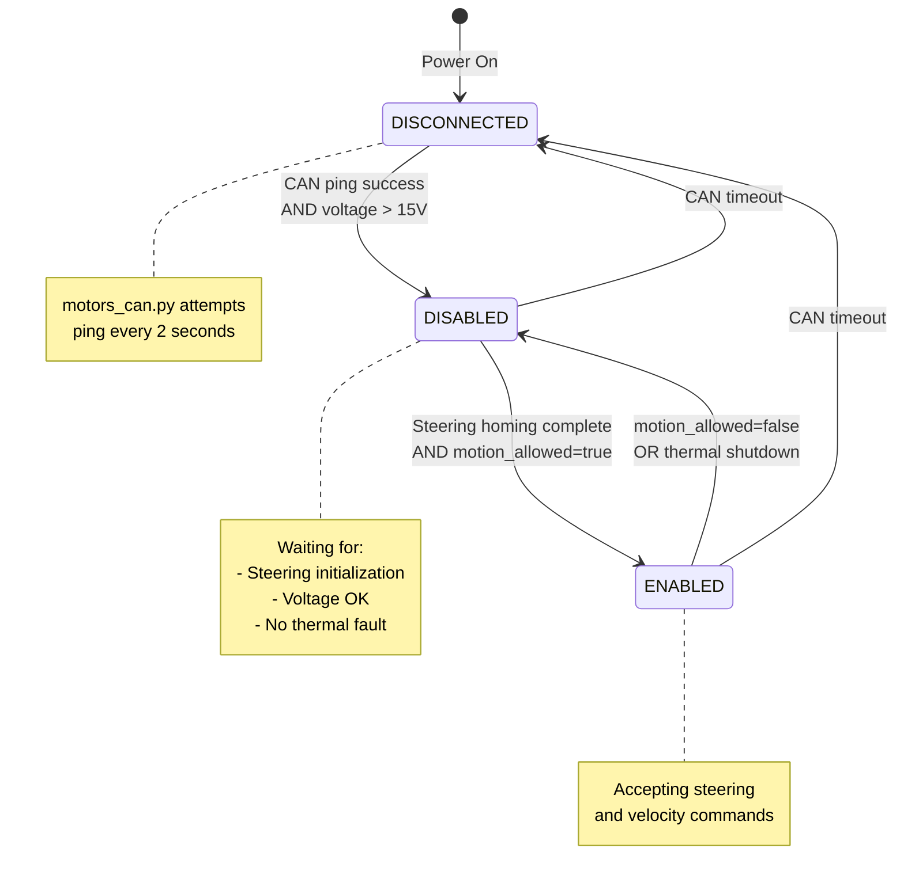
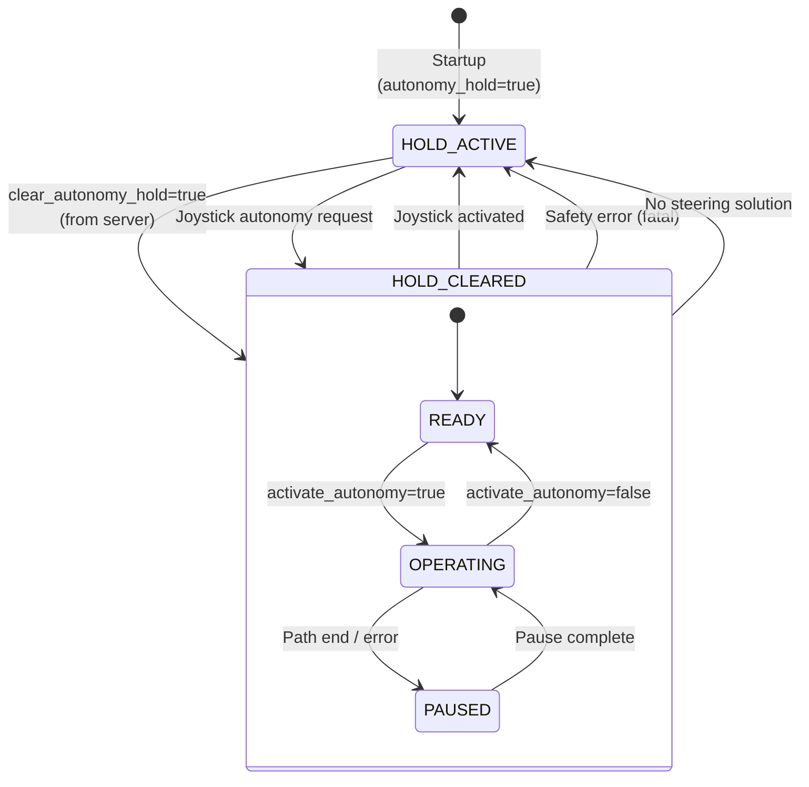
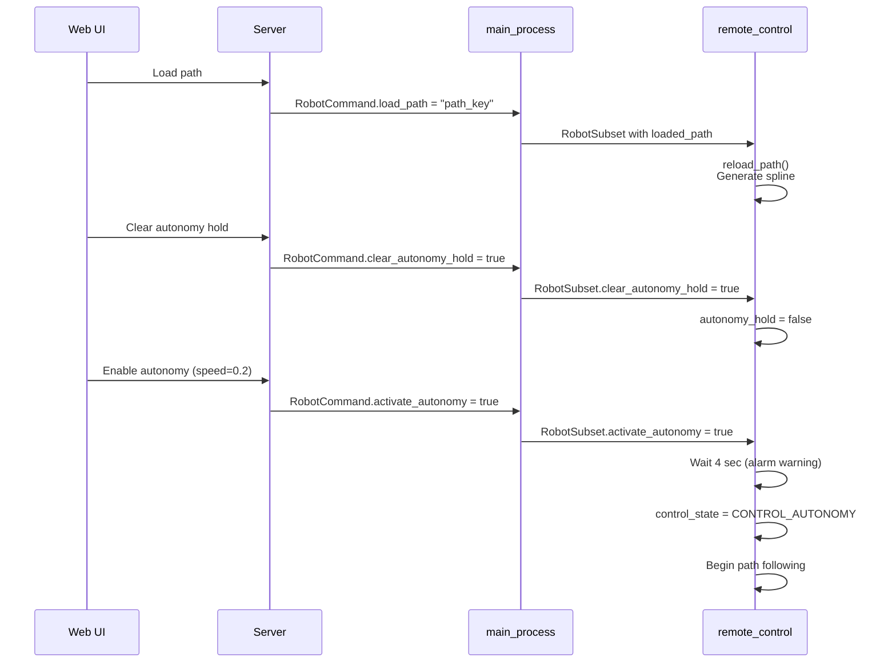
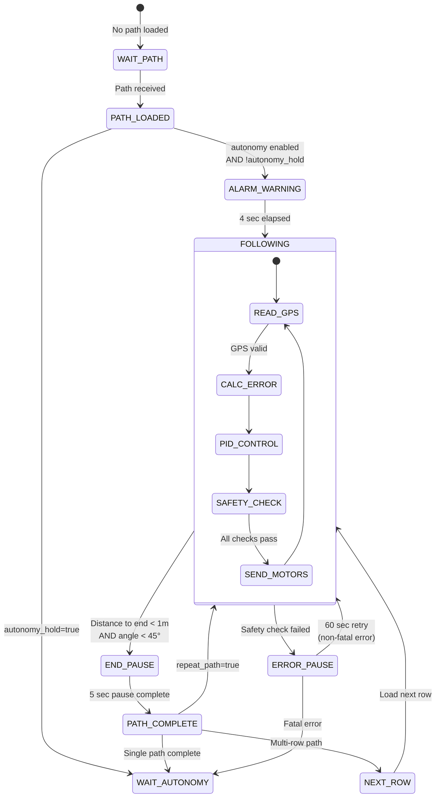
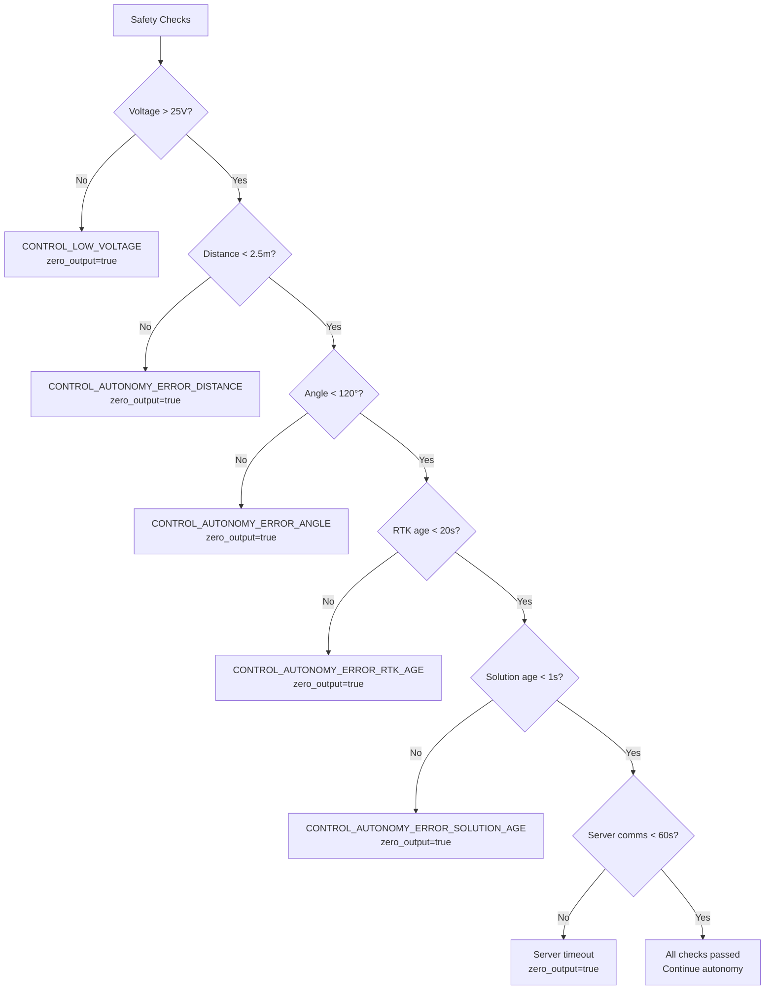
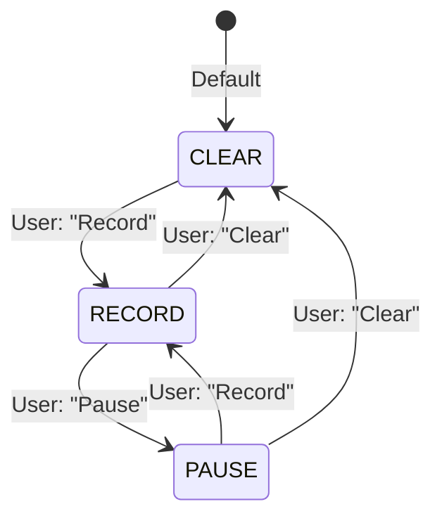
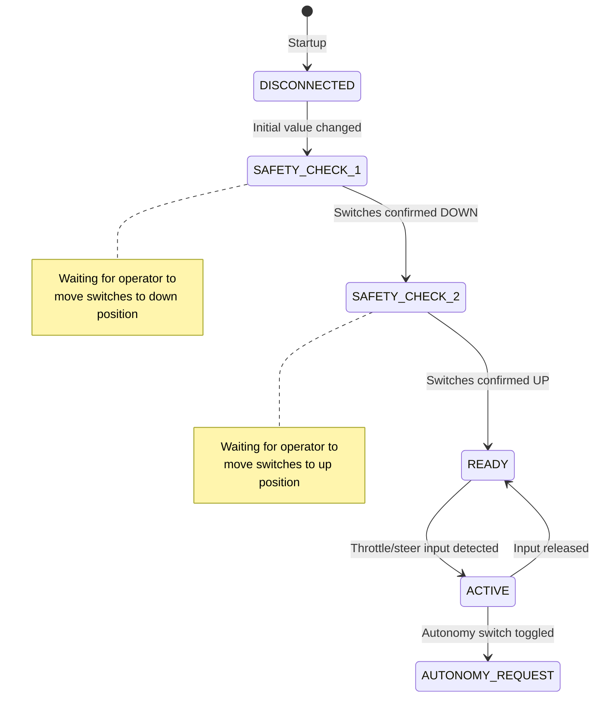
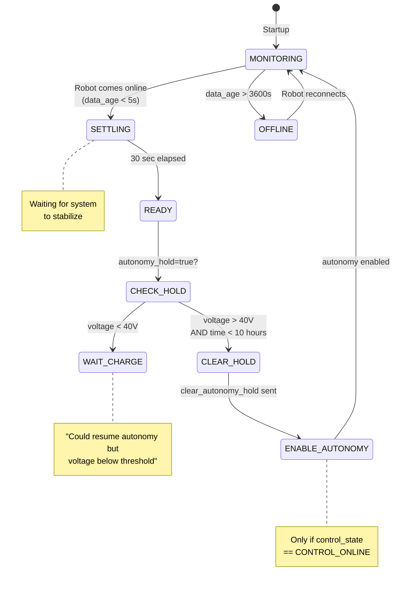

# Phase 5: State Machine Documentation

## Overview

This document details the state machines governing the Acorn system:
1. **Vehicle Control States** - Overall operational modes
2. **Motor States** - Hardware connection status
3. **Autonomy State Machine** - Path following logic
4. **GPS Recording States** - Path recording modes

---

## 1. Vehicle Control States

### State Definitions

From `model.py`:

| State | Constant | Description |
|-------|----------|-------------|
| **Startup** | `CONTROL_STARTUP` | "Initializing..." |
| **GPS Startup** | `CONTROL_GPS_STARTUP` | "Waiting for GPS fix." |
| **Online** | `CONTROL_ONLINE` | "Online and awaiting commands." |
| **Autonomy** | `CONTROL_AUTONOMY` | "Autonomy operating." |
| **Autonomy Pause** | `CONTROL_AUTONOMY_PAUSE` | "Temporary autonomy pause." |
| **Low Voltage** | `CONTROL_LOW_VOLTAGE` | "Low voltage Pause." |
| **Distance Error** | `CONTROL_AUTONOMY_ERROR_DISTANCE` | "Autonomy failed - too far from path." |
| **Angle Error** | `CONTROL_AUTONOMY_ERROR_ANGLE` | "Autonomy failed - path angle too great." |
| **RTK Age Error** | `CONTROL_AUTONOMY_ERROR_RTK_AGE` | "Autonomy failed - rtk base data too old." |
| **Solution Age Error** | `CONTROL_AUTONOMY_ERROR_SOLUTION_AGE` | "Autonomy failed - gps solution too old." |
| **Override** | `CONTROL_OVERRIDE` | "Remote control override." |
| **Server Error** | `CONTROL_SERVER_ERROR` | "Server communication error." |
| **Motor Error** | `CONTROL_MOTOR_ERROR` | "Motor error detected." |
| **No Steering Solution** | `CONTROL_NO_STEERING_SOLUTION` | "No steering solution possible." |

### State Transition Diagram



### State Transition Logic

From `remote_control_process.py`:

#### Startup → Online
```python
# Initial state
self.control_state = model.CONTROL_STARTUP
self.autonomy_hold = True

# Transitions to ONLINE when:
# - GPS sample is valid
# - Motors not in error
# - No autonomy requested
if not self.activate_autonomy:
    self.control_state = model.CONTROL_ONLINE
```

#### Online → Autonomy
```python
# Requires all conditions:
# 1. activate_autonomy = True (from server command)
# 2. Path is loaded (nav_path.points not empty)
# 3. autonomy_hold = False (cleared by server or joystick)
# 4. No safety check failures

if self.activate_autonomy and not zero_output:
    self.control_state = model.CONTROL_AUTONOMY
```

#### Joystick Override
```python
if self.joy.activated():
    self.autonomy_hold = True
    self.activate_autonomy = False
    self.control_state = model.CONTROL_OVERRIDE

if self.joy.autonomy_allowed == False:
    self.control_state = model.CONTROL_OVERRIDE
```

#### Error State Transitions
```python
# Distance error
if abs(absolute_path_distance) > self.nav_path.maximum_allowed_distance_meters:
    zero_output = True
    self.control_state = model.CONTROL_AUTONOMY_ERROR_DISTANCE

# Angle error
if abs(gps_path_angle_error) > self.nav_path.maximum_allowed_angle_error_degrees:
    zero_output = True
    self.control_state = model.CONTROL_AUTONOMY_ERROR_ANGLE

# RTK age error
if self.gps.last_sample().rtk_age > _ALLOWED_RTK_AGE_SEC:  # 20s
    zero_output = True
    self.control_state = model.CONTROL_AUTONOMY_ERROR_RTK_AGE

# Solution age error
if solution_age > _ALLOWED_SOLUTION_AGE_SEC:  # 1s
    zero_output = True
    self.control_state = model.CONTROL_AUTONOMY_ERROR_SOLUTION_AGE
```

---

## 2. Motor States

### State Definitions

From `model.py`:

| State | Value | String | Description |
|-------|-------|--------|-------------|
| **Disconnected** | `0` | "Not connected." | CAN bus not responding |
| **Disabled** | `1` | "Motor error." | Connected but not enabled |
| **Enabled** | `2` | "Motors enabled." | Ready for commands |

### State Transition Diagram



### State Transition Logic

From `motors_can.py`:

```python
# Initial state
self.motors_connected = False
self.motors_initialized = False

# DISCONNECTED → DISABLED
def run_main():
    while True:
        if not input_voltage_okay:
            voltage = self.voltage_monitor.return_one_sample()
            input_voltage_okay = voltage > _SAFE_STARTUP_VOLTAGE  # 15V
            self.communicate_message(model.MOTOR_DISABLED)
            continue

        if not self.motors_connected:
            self.connect_to_motors()  # CAN ping
            if self.motors_connected:
                # State is now DISABLED

        elif not self.motors_initialized:
            self.initialize_motors()  # Steering homing
            # State transitions to ENABLED when complete

# DISABLED → ENABLED
state_to_send = model.MOTOR_ENABLED
for drive in self.motors:
    if not drive.controller.motion_allowed:
        state_to_send = model.MOTOR_DISABLED
self.communicate_message(state_to_send)
```

### Motor State in Shared Memory

```python
# motors_can.py writes state to shared memory
send_vals = np.array([
    [state, model.CLEAR_TO_WRITE, 0, 0],  # state = MOTOR_*
    ...
])
self.motor_output_values[:] = send_vals[:]

# remote_control_process.py reads state
self.motor_state = int(motor_message[0][0])
```

---

## 3. Autonomy State Machine

### Autonomy Hold Logic

The `autonomy_hold` flag prevents autonomy from activating. It must be explicitly cleared.



### Autonomy Activation Sequence



### Path Following State Machine



### Safety Check Decision Tree



---

## 4. GPS Recording States

### State Definitions

From `model.py`:

| State | Constant | Description |
|-------|----------|-------------|
| **Clear** | `GPS_RECORDING_CLEAR` | No recording, buffer cleared |
| **Record** | `GPS_RECORDING_ACTIVATE` | Actively recording GPS points |
| **Pause** | `GPS_RECORDING_PAUSE` | Recording paused, buffer retained |

### State Transition Diagram



---

## 5. Joystick State Machine

### Joystick Activation Logic

From `remote_control_process.py`:



### Joystick Override Behavior

```python
# From remote_control_process.py

# Joystick takes immediate control
if self.joy.activated():
    self.logger.info("DISABLED AUTONOMY because joystick is activated")
    self.autonomy_hold = True
    self.activate_autonomy = False
    self.control_state = model.CONTROL_OVERRIDE

# Autonomy not allowed when switch is in wrong position
if self.joy.autonomy_allowed == False:
    self.autonomy_hold = True
    self.activate_autonomy = False
    self.control_state = model.CONTROL_OVERRIDE

# Joystick can request autonomy
elif self.joy.autonomy_requested == True:
    self.gps.flush_serial()
    self.autonomy_hold = False
    self.activate_autonomy = True
    self.joy.autonomy_requested = False
```

---

## 6. System Manager Automation (Server)

### Fleet Automation State Machine

From `system_manager.py`:



### Automation Thresholds

```python
# From system_manager.py

AUTONOMY_AT_STARTUP = True
AUTONOMY_SPEED = 0.2  # m/s

_ONLINE_DATA_AGE_MAXIMUM_SEC = 5        # Fresh data threshold
_OFFLINE_DATA_AGE_MINIMUM_SEC = 3600    # 1 hour = offline
_ONLINE_SETTLING_TIME_SEC = 30          # Wait before enabling
_RESUME_AUTONOMY_MINIMUM_VOLTAGE = 40   # Voltage threshold
_MAXIMUM_TIME_TO_ATTEMPT_AUTONOMY_SEC = 36000  # 10 hours
_CLEAR_AUTONOMY_HOLD_COMMAND_OBJECT_TIME_SEC = 5
_LOOP_DELAY_SEC = 2
```

---

## 7. State Summary Table

| Component | States | Primary Transitions |
|-----------|--------|---------------------|
| **Control State** | 14 states | Online ↔ Autonomy ↔ Error states |
| **Motor State** | 3 states | Disconnected → Disabled → Enabled |
| **Autonomy Hold** | 2 states | Hold ↔ Cleared |
| **GPS Recording** | 3 states | Clear ↔ Record ↔ Pause |
| **Joystick** | 5 states | Disconnected → Safety → Ready → Active |
| **System Manager** | 6 states | Monitoring → Settling → Enable |

---

## 8. Key Timing Constants

| Constant | Value | Purpose |
|----------|-------|---------|
| `_RESUME_MOTION_WARNING_TIME_SEC` | 4 sec | Alarm before autonomy starts |
| `_PATH_END_PAUSE_SEC` | 5 sec | Pause at path end |
| `_DISENGAGEMENT_RETRY_DELAY_SEC` | 60 sec | Wait after non-fatal error |
| `_ALLOWED_RTK_AGE_SEC` | 20 sec | Max RTK correction age |
| `_ALLOWED_SOLUTION_AGE_SEC` | 1 sec | Max GPS solution age |
| `SERVER_COMMUNICATION_DELAY_LIMIT_SEC` | 10 sec | Server timeout |
| `_ONLINE_SETTLING_TIME_SEC` | 30 sec | System manager settling |

---

## Next Steps

Phase 6 will create a configuration inventory:
- All hardcoded constants
- Default values
- Safety thresholds
- Tuning parameters
