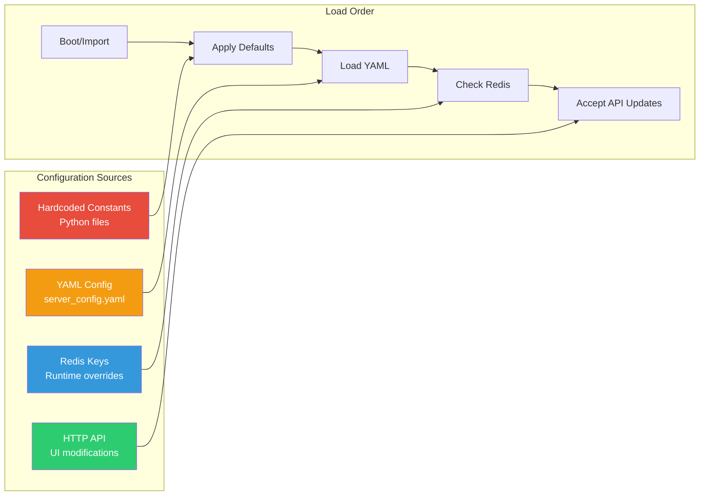

# Phase 6: Configuration & Constants Inventory

## Overview

This document catalogs all configurable parameters and constants across the Acorn system. These values control physical dimensions, timing behavior, control loop tuning, safety thresholds, and network communication. Understanding these parameters is essential for system tuning and future refactoring into a configurable framework.

---

## Configuration Categories

| Category | Description | Primary Files |
|----------|-------------|---------------|
| **Physical** | Robot geometry, sensor positions, mechanical limits | `steering.py`, `corner_actuator_can.py` |
| **Control Gains** | PID tuning, path following parameters | `remote_control_process.py` |
| **Safety** | Voltage cutoffs, error thresholds, position limits | `remote_control_process.py`, `gps.py` |
| **Timing** | Update rates, timeouts, polling intervals | `main_process.py`, `remote_control_process.py` |
| **Network** | ZMQ heartbeats, server timeouts, retry logic | `zmq_ppqueue.py`, `server_comms.py` |
| **Hardware** | CAN bus, ADC channels, sensor calibration | `corner_actuator_can.py`, `motor_controller.py` |

---

## Physical Constants

### Steering Geometry (`steering.py`)

| Constant | Value | Units | Description |
|----------|-------|-------|-------------|
| `_ABSOLUTE_STEERING_LIMIT` | `2π` | radians | Maximum steering rotation |
| `_PROJECTED_POINT_DISTANCE_METERS` | `1.0` | meters | Lookahead distance for path following |
| `_ERROR_RATE_AVERAGING_COUNT` | `3` | samples | Smoothing window for error derivative |

### Motor/Steering Conversion (`corner_actuator_can.py`)

| Constant | Value | Units | Description |
|----------|-------|-------|-------------|
| `STEERING_RADIANS_TO_COUNTS` | `440.32` | counts/rad | `1024.0 * 0.43` - encoder conversion |
| `STEERING_COUNTS_TO_RADIANS` | `0.00227` | rad/count | Inverse of above |
| `COMMAND_VALUE_MINIMUM` | `0.001` | - | Deadband threshold for commands |
| `_HOMING_VELOCITY_STEERING_COUNTS` | `800` | counts/s | Steering motor speed during homing |
| `_MAX_HOMING_ATTEMPTS` | `4` | - | Retry limit for homing sequence |
| `_ZERO_VEL_COUNTS_THRESHOLD` | `2` | counts | Velocity threshold for "stopped" |

### ADC Configuration (`corner_actuator_can.py`)

| Constant | Value | Description |
|----------|-------|-------------|
| `THERMISTOR_ADC_CHANNEL` | `3` | Temperature sensor input |
| `_ADC_PORT_STEERING_POT` | `5` | Position potentiometer input |
| `_ADC_PORT_STEERING_HOME` | `6` | Homing sensor input |
| `_VCC` | `3.3` | Reference voltage |
| `_POT_VOLTAGE_LOW` | `0.4125` | `VCC/8` - pot valid range low |
| `_POT_VOLTAGE_HIGH` | `2.8875` | `7*VCC/8` - pot valid range high |
| `_HOMING_POT_DEADBAND_VOLTS` | `0.2` | Homing position tolerance |

---

## Control Gains (PID Tuning)

### Path Following (`remote_control_process.py`)

| Constant | Value | Units | Description |
|----------|-------|-------|-------------|
| `_DEFAULT_ANGULAR_P` | `1.5` | - | Proportional gain for heading error |
| `_DEFAULT_ANGULAR_D` | `0.3` | - | Derivative gain for heading error |
| `_DEFAULT_LATERAL_P` | `0.25` | - | Proportional gain for cross-track error |
| `_DEFAULT_LATERAL_D` | `0.05` | - | Derivative gain for cross-track error |

### Speed Control (`remote_control_process.py`)

| Constant | Value | Units | Description |
|----------|-------|-------|-------------|
| `_DEFAULT_TRAVEL_SPEED` | `0.2` | m/s | Default autonomous speed |
| `_DEFAULT_MAXIMUM_VELOCITY` | `0.4` | m/s | Speed limit during autonomy |
| `ACCELERATION_COUNTS_SEC` | `0.5` | 1/s | Acceleration ramp rate |
| `_BEGIN_AUTONOMY_SPEED_RAMP_SEC` | `3.0` | seconds | Speed ramp-up duration |

### Path End Detection (`remote_control_process.py`)

| Constant | Value | Units | Description |
|----------|-------|-------|-------------|
| `_DEFAULT_PATH_END_DISTANCE_METERS` | `1.0` | meters | Distance threshold for path end |
| `_DEFAULT_PATH_END_ANGLE_DEGREES` | `45` | degrees | Angle threshold for path end |
| `_CLOSED_LOOP_ENDS_DISTANCE_METERS` | `2.0` | meters | Closure distance for loop detection |

---

## Safety Thresholds

### Voltage Limits

| Constant | Value | Units | File | Description |
|----------|-------|-------|------|-------------|
| `_VOLTAGE_CUTOFF` | `25` | V | `remote_control_process.py` | Autonomy disabled below this |
| `_VOLTAGE_RESUME_MANUAL_CONTROL` | `35` | V | `remote_control_process.py` | Manual control requires this |
| `_SAFE_STARTUP_VOLTAGE` | `15` | V | `motors_can.py` | Minimum for motor enable |
| `_SYSTEM_VOLTAGE_HOMING_THRESHOLD` | `30` | V | `corner_actuator_can.py` | Required for homing |
| `_RESUME_AUTONOMY_MINIMUM_VOLTAGE` | `40` | V | `system_manager.py` | Auto-resume threshold |

### Position/Error Limits

| Constant | Value | Units | File | Description |
|----------|-------|-------|------|-------------|
| `_MAXIMUM_ALLOWED_DISTANCE_METERS` | `2.5` | m | `remote_control_process.py` | Max cross-track error |
| `_MAXIMUM_ALLOWED_ANGLE_ERROR_DEGREES` | `120` | deg | `remote_control_process.py` | Max heading error |
| `MAX_VALID_SPEED_COMMAND` | `200` | counts | `motors_can.py` | Motor command limit |
| `MAX_ALLOWED_HACC_MM` | `550` | mm | `gps.py` | GPS accuracy limit |

### Thermal Limits (`motor_controller.py`)

| Constant | Value | Units | Description |
|----------|-------|-------|-------------|
| `THERMAL_WARNING_LIMIT` | `60` | °C | Log warning above this |
| `THERMAL_SHUTDOWN_LIMIT` | `100` | °C | Disable motors above this |

### GPS Quality Limits (`remote_control_process.py`)

| Constant | Value | Units | Description |
|----------|-------|-------|-------------|
| `_ALLOWED_RTK_AGE_SEC` | `20.0` | seconds | Max age of RTK correction |
| `_ALLOWED_SOLUTION_AGE_SEC` | `1.0` | seconds | Max age of GPS fix |
| `_GPS_ERROR_RETRIES` | `3` | - | Consecutive errors before fault |
| `_NUM_GPS_SUBSAMPLES` | `10` | - | GPS averaging window |

---

## Timing Parameters

### Update Rates (`main_process.py`, `remote_control_process.py`)

| Constant | Value | Units | File | Description |
|----------|-------|-------|------|-------------|
| `_UPDATE_PERIOD` | `2.0` | s | `main_process.py` | Server state update interval |
| `_SIMULATION_UPDATE_PERIOD` | `0.1` | s | `main_process.py` | Simulation mode update rate |
| `_SIMULATED_LOOP_RATE_HZ` | `30` | Hz | `remote_control_process.py` | Control loop rate (sim) |

### Polling Intervals

| Constant | Value | Units | File | Description |
|----------|-------|-------|------|-------------|
| `_POLL_MILLISECONDS` | `100` | ms | `remote_control_process.py` | Standard poll interval |
| `_FAST_POLL_MILLISECONDS` | `20` | ms | `remote_control_process.py` | Fast poll for motors |
| `_VERY_FAST_POLL_MILLISECONDS` | `1` | ms | `remote_control_process.py` | Highest priority poll |
| `_SLOW_POLLING_SLEEP_S` | `0.5` | s | `remote_control_process.py` | Idle state poll |
| `_FAST_POLLING_SLEEP_S` | `0.01` | s | `corner_actuator_can.py` | Homing poll interval |

### Timeouts & Delays

| Constant | Value | Units | File | Description |
|----------|-------|-------|------|-------------|
| `_PATH_END_PAUSE_SEC` | `5.0` | s | `remote_control_process.py` | Pause at path end |
| `_RESUME_MOTION_WARNING_TIME_SEC` | `4` | s | `remote_control_process.py` | Alarm before autonomy starts |
| `_DISENGAGEMENT_RETRY_DELAY_MINUTES` | `1` | min | `remote_control_process.py` | Retry after error |
| `_ALLOWED_MOTOR_SEND_LAPSE_SEC` | `5` | s | `remote_control_process.py` | Max motor command gap |
| `_SHUT_DOWN_MOTORS_COMMS_DELAY_S` | `3.0` | s | `motors_can.py` | Delay before motor shutdown |
| `_ERROR_RECOVERY_DELAY_S` | `5` | s | `motors_can.py` | Delay after motor error |

### Server Communication Timeouts

| Constant | Value | Units | File | Description |
|----------|-------|-------|------|-------------|
| `_MAX_ALLOWED_SERVER_COMMS_OUTAGE_SEC` | `60` | s | `main_process.py` | Max server silence |
| `_SERVER_REPLY_TIMEOUT_MILLISECONDS` | `3000` | ms | `main_process.py` | ZMQ reply timeout |
| `_SERVER_DELAY_RECONNECT_WIFI_SECONDS` | `120` | s | `remote_control_process.py` | Wifi reconnect trigger |
| `_SERVER_CONNECT_TIME_LIMIT_MINUTES` | `10` | min | `main_process.py` | Initial connect timeout |
| `_SERVER_PING_DELAY_SEC` | `2` | s | `main_process.py` | Ping interval |

### GPS Timing (`gps.py`)

| Constant | Value | Units | Description |
|----------|-------|-------|-------------|
| `BAUD` | `921600` | baud | Serial port speed |
| `HISTORY_SAMPLE_PERIOD_S` | `1` | s | Position history sampling |
| `TOTAL_HISTORY_SAMPLE_DURATION_S` | `120` | s | Position history length |
| `MAXIMUM_SERIAL_BYTES_IN_WAITING` | `200` | bytes | Buffer overflow threshold |

---

## Network Configuration

### ZMQ Paranoid Pirate (`zmq_ppqueue.py`)

| Constant | Value | Units | Description |
|----------|-------|-------|-------------|
| `HEARTBEAT_LIVENESS` | `3` | - | Missed heartbeats before disconnect |
| `HEARTBEAT_INTERVAL` | `1.0` | s | Time between heartbeats |
| `PPP_READY` | `0x01` | - | Worker ready signal |
| `PPP_HEARTBEAT` | `0x02` | - | Heartbeat message type |

### Lazy Pirate Client (`server_comms.py`)

| Constant | Value | Units | Description |
|----------|-------|-------|-------------|
| `_POLL_TIMEOUT_SEC` | `2.5` | s | ZMQ poll timeout |

### System Manager Automation (`system_manager.py`)

| Constant | Value | Units | Description |
|----------|-------|-------|-------------|
| `AUTONOMY_AT_STARTUP` | `True` | - | Enable autonomy on boot |
| `AUTONOMY_SPEED` | `0.2` | m/s | Default speed for automation |
| `_ONLINE_DATA_AGE_MAXIMUM_SEC` | `5` | s | Max data age for "online" |
| `_OFFLINE_DATA_AGE_MINIMUM_SEC` | `3600` | s | Min age for "offline" |
| `_ONLINE_SETTLING_TIME_SEC` | `30` | s | Time before auto-activate |
| `_MAXIMUM_TIME_TO_ATTEMPT_AUTONOMY_SEC` | `36000` | s | 10 hours max attempt |
| `_LOOP_DELAY_SEC` | `2` | s | Manager loop interval |

---

## Debug & Logging Flags

| Constant | Value | File | Description |
|----------|-------|------|-------------|
| `BOARD_VERSION` | `2` | `remote_control_process.py` | Hardware revision |
| `IGNORE_SERVER_COMMUNICATIONS_ERRORS` | `True` | `remote_control_process.py` | Fault tolerance flag |
| `BYPASS_STEERING_LIMITS` | `False` | `motors_can.py` | Disable safety limits |
| `PRINT_REMOTE_LOG_MESSAGES` | `False` | `motors_can.py` | Verbose logging |
| `_DEBUG_STEERING` | `False` | `remote_control_process.py` | Steering debug output |
| `_USE_SBUS_JOYSTICK` | `True` | `remote_control_process.py` | Enable S.Bus RC |
| `GPS_PRINT_INTERVAL` | `30` | `remote_control_process.py` | GPS log frequency |
| `_DEFAULT_LOGGING_SKIP_RATE` | `200` | `remote_control_process.py` | Log message throttle |
| `_ERROR_SKIP_RATE` | `60` | `remote_control_process.py` | Error log throttle |
| `INDUCTION_STEERING_SENSOR` | `True` | `corner_actuator_can.py` | Sensor type selection |
| `SHOULD_SYSTEM_USE_HOMING` | `False` | `corner_actuator_can.py` | Derived from sensor type |

---

## Hardware Pin Assignments

### Corner Actuator (`corner_actuator_can.py`)

| Constant | Value | Description |
|----------|-------|-------------|
| `ESTOP_PIN` | `6` | Emergency stop GPIO |
| `_HOME_SENSOR_HOMING_THRESHOLD` | `120` | Induction sensor threshold |

### Error Codes (`motor_controller.py`)

| Constant | Value | Description |
|----------|-------|-------------|
| `ERROR_CODE_INVALID_SPEED_COMMAND` | `0x02` | Speed command out of range |
| `ERROR_CODE_INCONSISTENT_COMMS` | `0x04` | Communication mismatch |
| `ERROR_CODE_INDUCTION_ENCODER_OFFLINE` | `0x08` | Encoder not responding |

### CAN Reply Limits (`corner_actuator_can.py`)

| Constant | Value | Description |
|----------|-------|-------------|
| `DEFAULT_CAN_REPLY_ERROR_LIMIT` | `10` | Max consecutive CAN errors |

---

## Configuration Flow Diagram



---

## Refactoring Recommendations

### High Priority: Extract to Configuration File

These constants should be moved to external configuration for easier tuning:

1. **PID Gains** - Currently hardcoded, should be in YAML
2. **Safety Thresholds** - Voltage cutoffs, distance limits
3. **Timing Parameters** - Update rates, timeouts
4. **Sensor Calibration** - ADC channels, conversion factors

### Medium Priority: Environment-Specific

These vary between deployments:

1. **Network Timeouts** - Different for local vs. remote operation
2. **GPS Quality Thresholds** - May vary by site conditions
3. **Automation Thresholds** - `system_manager.py` values

### Current Configuration Locations

| File | Configuration Type | Format |
|------|-------------------|--------|
| `server_config.yaml` | Server connection, paths | YAML |
| `vehicle/*.py` | Constants | Python hardcoded |
| Redis | Runtime state | Pickle serialized |

### Proposed Unified Configuration

```yaml
# proposed: vehicle_config.yaml
physical:
  steering_radians_to_counts: 440.32
  projected_point_distance_m: 1.0

control:
  pid:
    angular_p: 1.5
    angular_d: 0.3
    lateral_p: 0.25
    lateral_d: 0.05
  speed:
    default_travel_speed: 0.2
    maximum_velocity: 0.4
    acceleration_rate: 0.5

safety:
  voltage:
    cutoff: 25
    resume_manual: 35
    startup_minimum: 15
  position:
    max_cross_track_error_m: 2.5
    max_heading_error_deg: 120
  gps:
    max_rtk_age_sec: 20.0
    max_solution_age_sec: 1.0
    max_hacc_mm: 550

timing:
  update_period_sec: 2.0
  path_end_pause_sec: 5.0
  server_timeout_sec: 60
```

---

## Summary

The Acorn system has **~80 configurable constants** distributed across 12 source files. The majority are hardcoded in Python modules, with only server connection details externalized to YAML. Key observations:

1. **No central configuration** - Parameters are scattered across files
2. **Mixed units** - Some values in SI, others in counts or milliseconds
3. **Implicit dependencies** - Some constants derive from others (e.g., `STEERING_COUNTS_TO_RADIANS`)
4. **Runtime modification limited** - Most values require code changes to update

Future refactoring should consolidate these into a hierarchical YAML configuration with validation, unit documentation, and runtime override capability through the Redis/API layer.
