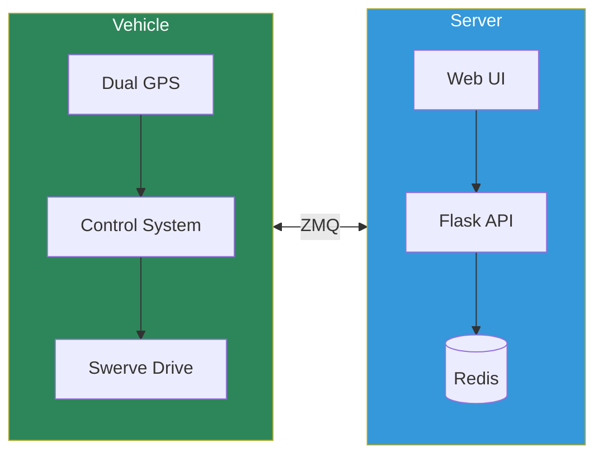
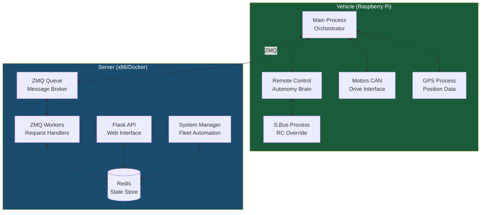

# Acorn Precision Farming Rover

Welcome to the technical documentation for the Acorn Precision Farming Rover, an autonomous agricultural robot developed by Twisted Fields.

## Overview

The Acorn rover uses RTK-GPS guided navigation to autonomously follow pre-recorded paths for precision farming tasks. The system consists of two main deployable components:

- **Vehicle**: Raspberry Pi-based rover with swerve drive, dual GPS receivers, and CAN bus motor control
- **Server**: Command and control server providing web UI, fleet management, and data persistence

## Architecture Documentation

This documentation covers the system architecture across six phases:

| Phase | Document | Description |
|-------|----------|-------------|
| 1 | [System Context](architecture/01-system-context.md) | C4 diagrams, deployment topology, system boundaries |
| 2 | [Components](architecture/02-components.md) | Vehicle processes, server services, IPC mechanisms |
| 3 | [Data Flows](architecture/03-data-flows.md) | State flows, command flows, autonomy control loop |
| 4 | [Interfaces](architecture/04-interfaces.md) | ZMQ, HTTP API, CAN bus, Redis protocols |
| 5 | [State Machines](architecture/05-state-machines.md) | Control states, motor states, safety checks |
| 6 | [Configuration](architecture/06-configuration.md) | Constants inventory, tuning parameters |

## Quick Links

- [Documentation Plan](architecture/DOCUMENTATION_PLAN.md) - Overview of documentation approach
- [GitHub Repository](https://github.com/sequoia-hope/acorn-precision-farming-rover)

## Key System Characteristics

| Aspect | Details |
|--------|---------|
| **Navigation** | RTK-GPS with dual UBlox receivers for position + heading |
| **Drive System** | 4-wheel independent swerve drive (Chief Delphi algorithm) |
| **Control** | PID path following with cross-track and heading error correction |
| **Communication** | ZMQ (Lazy Pirate / Paranoid Pirate patterns) |
| **Safety** | Multi-layer checks: voltage, GPS quality, position error, server comms |

## System Architecture

## Getting Started

To explore the architecture:

1. Start with [System Context](architecture/01-system-context.md) for the big picture
2. Dive into [Components](architecture/02-components.md) to understand the processes
3. Follow [Data Flows](architecture/03-data-flows.md) to see how information moves
4. Reference [Interfaces](architecture/04-interfaces.md) for protocol details
5. Study [State Machines](architecture/05-state-machines.md) for operational logic
6. Check [Configuration](architecture/06-configuration.md) for tunable parameters
